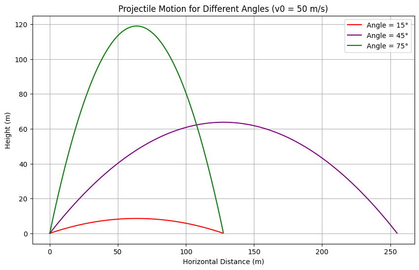
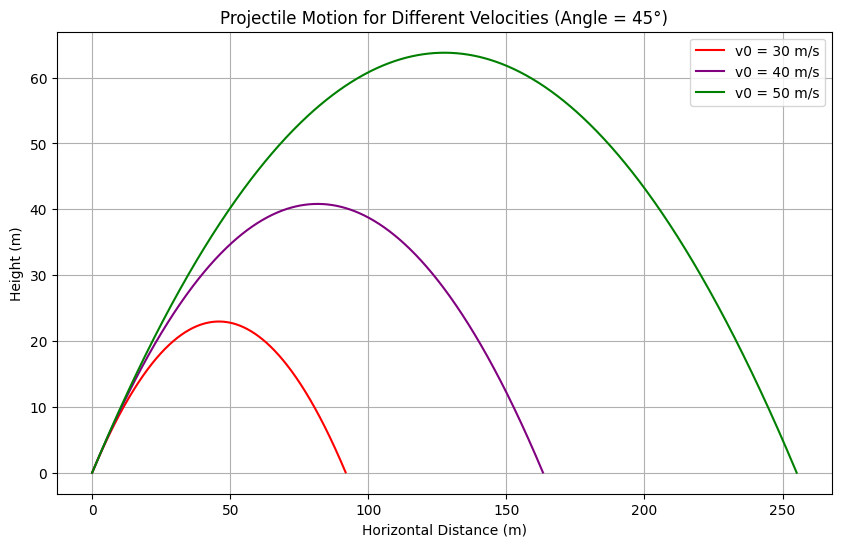
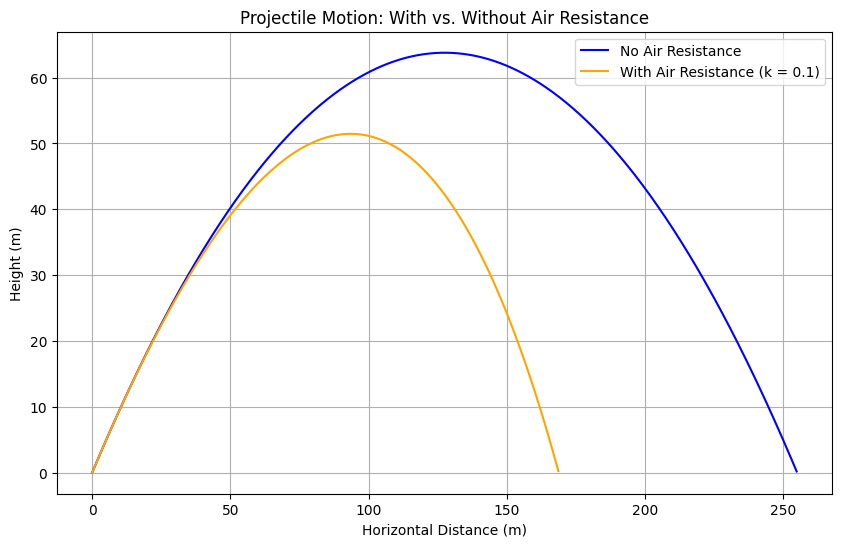

# # Problem 1


## # Theoretical Foundation

## Derivation from Differential Equations

Projectile motion can be described using Newton’s second law. Assuming no air resistance initially, the only force is gravity acting downward. Define the coordinate system with x-axis horizontal and y-axis vertical.

### Horizontal Motion (x-direction)

- No acceleration in the x-direction:  
  d²x/dt² = 0

- Initial velocity in x-direction:  
  v₀ₓ = v₀ * cos(θ)

- Integrate:  
  dx/dt = v₀ * cos(θ)  
  x(t) = (v₀ * cos(θ)) * t

### Vertical Motion (y-direction)

- Acceleration due to gravity g = 9.8 m/s² downward:  
  d²y/dt² = -g

- Initial velocity in y-direction:  
  v₀ᵧ = v₀ * sin(θ)

- Integrate:  
  dy/dt = v₀ * sin(θ) - g * t  
  y(t) = (v₀ * sin(θ)) * t - (1/2) * g * t²

### Range Calculation

The projectile hits the ground when y(t) = 0:

    (v₀ * sin(θ)) * t - (1/2) * g * t² = 0  
    t * (v₀ * sin(θ) - (1/2) * g * t) = 0

Solutions:  
- t = 0 (start)  
- t = (2 * v₀ * sin(θ)) / g (time of flight)

Substitute t into x(t):

    R = (v₀ * cos(θ)) * (2 * v₀ * sin(θ)) / g  
      = (2 * v₀² * sin(θ) * cos(θ)) / g  
      = (v₀² * sin(2θ)) / g

---

## Analysis of the Range

## Range vs. Angle of Projection

The range formula:  
R = (v₀² * sin(2θ)) / g

Maximum range occurs at θ = 45°.

**Example**:  
v₀ = 50 m/s, θ = 45°  
R = (2500 * sin(90°)) / 9.8 ≈ 255 m 

**Other Angles**:  
- θ = 15° → R ≈ 91.8 m  
- θ = 75° → R ≈ 163 m

## Effect of Initial Velocity

| v₀ (m/s) | θ (°) | Range (m) |
|----------|-------|-----------|
| 30       | 45    | 91.8      |
| 40       | 45    | 163       |
| 50       | 45    | 255       |

Range increases with square of v₀.

## Effect of Gravitational Acceleration

If g increases, range decreases  
(e.g., on a planet with stronger gravity).

---

# Practical Applications

- **Sports**: Optimizing the launch angle in golf, javelin, etc.
- **Engineering**: Designing projectile systems and launchers.
- **Astrophysics**: Modeling satellite launches 

**Limitations**:
- Air resistance reduces range and alters trajectory
- Uneven terrain or wind affects the projectile's path

---

## Implementation: Projectile Motion Simulation

### Plot 1: Trajectories for Different Angles (15°, 45°, 75°) at 50 m/s
Below is the Python code to generate a plot similar to part (a) of the image.

```python
import numpy as np
import matplotlib.pyplot as plt

# Constants
g = 9.8  # m/s^2
v0 = 50  # m/s
angles = [15, 45, 75]  # degrees
colors = ['red', 'purple', 'green']

# Time array for simulation
t_max = 2 * v0 * np.sin(np.radians(max(angles))) / g
t = np.linspace(0, t_max, 1000)

plt.figure(figsize=(10, 6))
for angle, color in zip(angles, colors):
    theta = np.radians(angle)
    # Positions
    x = v0 * np.cos(theta) * t
    y = v0 * np.sin(theta) * t - 0.5 * g * t**2
    # Stop when y <= 0 (ground)
    mask = y >= 0
    plt.plot(x[mask], y[mask], label=f'Angle = {angle}°', color=color)

plt.title('Projectile Motion for Different Angles (v0 = 50 m/s)')
plt.xlabel('Horizontal Distance (m)')
plt.ylabel('Height (m)')
plt.legend()
plt.grid(True)
plt.show()
```


### Plot 2: Trajectories for Different Velocities (30, 40, 50 m/s) at 45°
```python
# Constants
g = 9.8  # m/s^2
v0s = [30, 40, 50]  # m/s
angle = 45  # degrees
colors = ['red', 'purple', 'green']

# Time array
t_max = 2 * max(v0s) * np.sin(np.radians(angle)) / g
t = np.linspace(0, t_max, 1000)

plt.figure(figsize=(10, 6))
for v0, color in zip(v0s, colors):
    theta = np.radians(angle)
    x = v0 * np.cos(theta) * t
    y = v0 * np.sin(theta) * t - 0.5 * g * t**2
    mask = y >= 0
    plt.plot(x[mask], y[mask], label=f'v0 = {v0} m/s', color=color)

plt.title('Projectile Motion for Different Velocities (Angle = 45°)')
plt.xlabel('Horizontal Distance (m)')
plt.ylabel('Height (m)')
plt.legend()
plt.grid(True)
plt.show()
```


### Plot 3: Projectile Motion With and Without Air Resistance
Now, let’s simulate projectile motion with air resistance. Air resistance introduces a drag force proportional to velocity: \( F_{\text{drag}} = -k v \).

#### Differential Equations with Air Resistance
- \( x \)-direction: \( m \frac{d^2 x}{dt^2} = -k \frac{dx}{dt} \)
- \( y \)-direction: \( m \frac{d^2 y}{dt^2} = -mg - k \frac{dy}{dt} \)

We’ll solve these numerically using the Euler method.

```python
# Constants
g = 9.8
v0 = 50
angle = 45
theta = np.radians(angle)
k = 0.1  # drag coefficient
m = 1  # mass in kg
dt = 0.01  # time step
t_max = 10

# Initial conditions
vx = v0 * np.cos(theta)
vy = v0 * np.sin(theta)
x, y = 0, 0
x_no_air, y_no_air = 0, 0
t = 0

# Lists to store trajectories
x_traj, y_traj = [x], [y]
x_no_air_traj, y_no_air_traj = [x_no_air], [y_no_air]

# Euler method simulation
while y >= 0 or y_no_air >= 0:
    # With air resistance
    ax = -k * vx / m
    ay = -g - k * vy / m
    vx += ax * dt
    vy += ay * dt
    x += vx * dt
    y += vy * dt

    # Without air resistance
    x_no_air = v0 * np.cos(theta) * t
    y_no_air = v0 * np.sin(theta) * t - 0.5 * g * t**2

    # Append to trajectories
    if y >= 0:
        x_traj.append(x)
        y_traj.append(y)
    if y_no_air >= 0:
        x_no_air_traj.append(x_no_air)
        y_no_air_traj.append(y_no_air)

    t += dt

# Plot
plt.figure(figsize=(10, 6))
plt.plot(x_no_air_traj, y_no_air_traj, label='No Air Resistance', color='blue')
plt.plot(x_traj, y_traj, label='With Air Resistance (k = 0.1)', color='orange')
plt.title('Projectile Motion: With vs. Without Air Resistance')
plt.xlabel('Horizontal Distance (m)')
plt.ylabel('Height (m)')
plt.legend()
plt.grid(True)
plt.show()
```

---



## Discussion on Limitations
- **Idealized Model**: Assumes no air resistance, flat terrain, and constant gravity.
- **Air Resistance**: Reduces range and height, as shown in the plot.
---

## Conclusion
This analysis demonstrates the dependence of a projectile’s range on the angle of projection, with a maximum at 45°. Variations in initial velocity and air resistance significantly affect the trajectory, as visualized in the plots. These principles apply to diverse fields, from sports to engineering, though real-world factors like drag must be considered for accurate modeling. Kepler’s Laws and Orbital Mechanics


[Solutions in Colab](https://colab.research.google.com/drive/1tWmtdXOvZAsDkjqHjQtRI2Ya-a7wjvpl?usp=sharing)