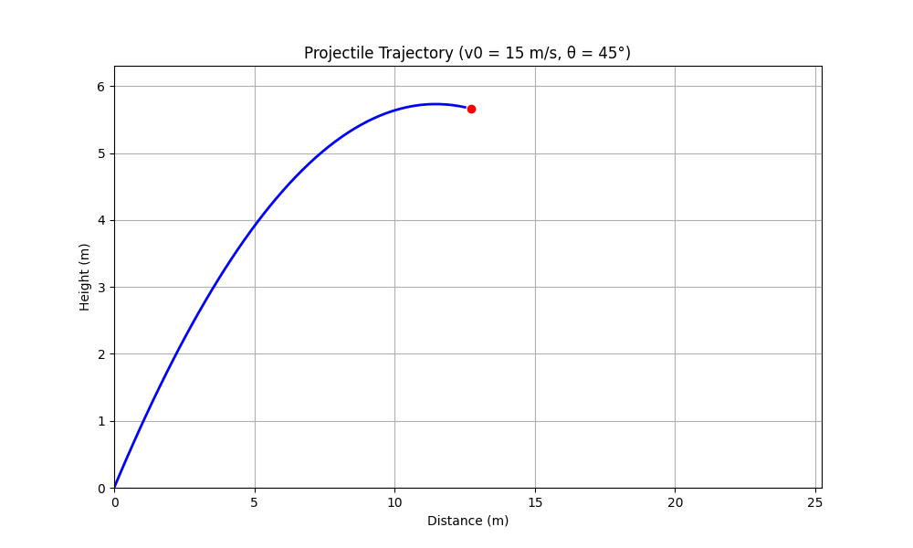

# Problem 1
### 1. Theoretical Foundation


# Investigating the Range as a Function of the Angle of Projection

## 1. Theoretical Foundation

Projectile motion is governed by Newton’s laws of motion under constant gravitational acceleration. Let’s derive the equations step-by-step.

### Governing Equations
Assume a projectile is launched with initial velocity \( v_0 \) at an angle \( \theta \) from the horizontal, with no air resistance and constant gravitational acceleration \( g \). The initial conditions are:
- Horizontal velocity: \( v_{x0} = v_0 \cos\theta \)
- Vertical velocity: \( v_{y0} = v_0 \sin\theta \)

The acceleration is:
- \( a_x = 0 \) (no horizontal acceleration)
- \( a_y = -g \) (downward gravitational acceleration)

The position as a function of time \( t \) is found by integrating the accelerations:
- Horizontal: \( x(t) = v_{x0} t = v_0 \cos\theta \, t \)
- Vertical: \( y(t) = v_{y0} t - \frac{1}{2} g t^2 = v_0 \sin\theta \, t - \frac{1}{2} g t^2 \)

### Time of Flight
The projectile hits the ground when \( y(t) = 0 \) (assuming launch height is zero):
$$
v_0 \sin\theta \, t - \frac{1}{2} g t^2 = 0
$$
Factorizing:
$$
t (v_0 \sin\theta - \frac{1}{2} g t) = 0
$$
Solutions: \( t = 0 \) (start) or \( t = \frac{2 v_0 \sin\theta}{g} \) (time of flight).

### Range
The horizontal range \( R \) is the distance traveled when \( t = \frac{2 v_0 \sin\theta}{g} \):
$$
R = v_0 \cos\theta \cdot \frac{2 v_0 \sin\theta}{g} = \frac{2 v_0^2 \sin\theta \cos\theta}{g}
$$
Using the identity \( \sin 2\theta = 2 \sin\theta \cos\theta \):
$$
R = \frac{v_0^2 \sin 2\theta}{g}
$$
This is the general form of the range, showing dependence on \( \theta \), \( v_0 \), and \( g \).

### Family of Solutions
The equation \( R = \frac{v_0^2 \sin 2\theta}{g} \) represents a family of solutions parameterized by \( v_0 \) and \( g \). Different initial conditions yield distinct ranges and trajectories.

## 2. Analysis of the Range

The range depends on \( \sin 2\theta \), which has a maximum value of 1 when \( 2\theta = 90^\circ \), or \( \theta = 45^\circ \). Thus, the maximum range is:
$$
R_{\text{max}} = \frac{v_0^2}{g} \quad \text{at} \quad \theta = 45^\circ
$$

- **Initial Velocity (\( v_0 \))**: Range scales with \( v_0^2 \), so doubling \( v_0 \) quadruples \( R \).
- **Gravitational Acceleration (\( g \))**: Range is inversely proportional to \( g \). On the Moon (\( g \approx 1.62 \, \text{m/s}^2 \)), the range is greater than on Earth (\( g = 9.81 \, \text{m/s}^2 \)).
- **Angle (\( \theta \))**: \( R \) is symmetric about \( 45^\circ \) (e.g., \( \theta = 30^\circ \) and \( 60^\circ \) yield the same range).

## 3. Practical Applications

- **Sports**: A soccer ball’s trajectory depends on kick angle and speed, optimized near \( 45^\circ \) for distance.
- **Engineering**: Artillery and rocket launches adjust \( \theta \) and \( v_0 \) for target range.
- **Astrophysics**: Trajectories on other planets (e.g., Mars, \( g = 3.72 \, \text{m/s}^2 \)) require adjusted models.
- **Uneven Terrain**: Non-zero launch height modifies the time of flight and range (requires quadratic solving).
- **Air Resistance**: Introduces damping, reducing range and altering optimal \( \theta \).

## 4. Implementation

Below is a Python script simulating projectile motion, plotting range vs. angle, and animating a trajectory.

### Python Code
```python
import numpy as np
import matplotlib.pyplot as plt
from matplotlib.animation import FuncAnimation
from IPython.display import HTML

# Constants
g = 9.81  # m/s^2 (Earth gravity)
v0_values = [10, 15, 20]  # Initial velocities (m/s)

# Range function
def range_theta(theta, v0, g):
    return (v0**2 * np.sin(2 * np.radians(theta))) / g

# Trajectory function
def trajectory(t, v0, theta, g):
    x = v0 * np.cos(np.radians(theta)) * t
    y = v0 * np.sin(np.radians(theta)) * t - 0.5 * g * t**2
    return x, y

# Part 1: Range vs Angle Plot
theta = np.linspace(0, 90, 91)  # Angles from 0 to 90 degrees
plt.figure(figsize=(10, 6))
for v0 in v0_values:
    R = range_theta(theta, v0, g)
    plt.plot(theta, R, label=f'v0 = {v0} m/s')
plt.xlabel('Angle of Projection (degrees)')
plt.ylabel('Range (m)')
plt.title('Range vs. Angle of Projection')
plt.legend()
plt.grid(True)
plt.show()


# Part 2: Animation of Trajectory (for v0 = 15 m/s, theta = 45°)
v0_anim = 15
theta_anim = 45
t_flight = 2 * v0_anim * np.sin(np.radians(theta_anim)) / g
t = np.linspace(0, t_flight, 100)
x, y = trajectory(t, v0_anim, theta_anim, g)

fig, ax = plt.subplots(figsize=(10, 6))
ax.set_xlim(0, max(x) * 1.1)
ax.set_ylim(0, max(y) * 1.1)
ax.set_xlabel('Distance (m)')
ax.set_ylabel('Height (m)')
ax.set_title(f'Projectile Trajectory (v0 = {v0_anim} m/s, θ = {theta_anim}°)')
ax.grid(True)

line, = ax.plot([], [], 'b-', lw=2)
point, = ax.plot([], [], 'ro')

def init():
    line.set_data([], [])
    point.set_data([], [])
    return line, point

def animate(i):
    line.set_data(x[:i], y[:i])
    point.set_data([x[i]], [y[i]])
    return line, point

anim = FuncAnimation(fig, animate, init_func=init, frames=len(t), interval=50, blit=True)
plt.close()  # Prevents duplicate static plot
HTML(anim.to_jshtml())  # Displays animation in Jupyter; save as GIF in VS Code if needed
```



### Instructions for Visual Studio Code
1. Install dependencies: `pip install numpy matplotlib IPython`.
2. Replace the last line (`HTML(anim.to_jshtml())`) with `anim.save('projectile.gif', writer='pillow', fps=20)` to save the animation as a GIF.
3. Run the script to generate the range plot and animation.

### Graphical Outputs
- **Range vs. Angle**: The plot shows \( R \) vs. \( \theta \) for \( v_0 = 10, 15, 20 \, \text{m/s} \), peaking at \( 45^\circ \).
- **Animation**: A trajectory for \( v_0 = 15 \, \text{m/s} \), \( \theta = 45^\circ \), showing the parabolic path.

## Discussion of Limitations

- **Idealized Model**: Assumes no air resistance, flat terrain, and constant \( g \).
- **Realistic Factors**:
  - **Drag**: Reduces range; optimal \( \theta \) shifts below \( 45^\circ \).
  - **Wind**: Alters trajectory unpredictably.
  - **Height**: Non-zero launch height requires solving a quadratic for time of flight.
- **Suggestions**: Use numerical methods (e.g., Runge-Kutta) to include drag (\( F_d = -k v^2 \)) or wind forces.

## Conclusion

This analysis reveals the elegance of projectile motion’s dependence on \( \theta \), \( v_0 \), and \( g \), while highlighting its adaptability to real-world scenarios. The computational tools provide visual insights, making it a powerful teaching and engineering tool.

---

### Notes for Presentation
- Show the range plot to explain the \( 45^\circ \) maximum.
- Play the animation (or show the GIF) to visualize motion.
- Discuss how tweaking \( v_0 \) or \( g \) changes outcomes, linking to sports or space exploration.

Let me know if you need adjustments or additional features!