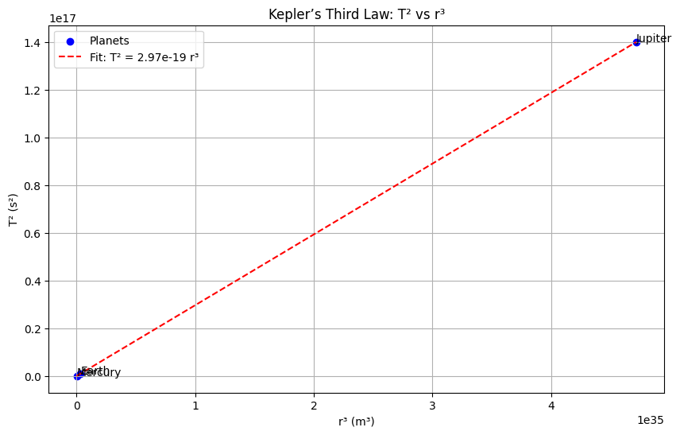

# # Problem 1

## : Projectile Motion and Kepler’s Laws

### Motivation
Projectile motion and orbital mechanics are foundational in physics, illustrating Newton’s and Kepler’s laws. While projectile motion demonstrates motion under constant gravity, Kepler’s laws describe planetary orbits, connecting period $T$ and semi-major axis $r$ to gravitational forces.

## 1. Theoretical Foundation

### Governing Equations
A projectile launched with velocity $v_0$ at angle $\theta$, under gravity $g$, has:

- Horizontal velocity: $v_{x0} = v_0 \cos\theta$
- Vertical velocity: $v_{y0} = v_0 \sin\theta$
- Accelerations: $a_x = 0$, $a_y = -g$

- Positions:
  - $x(t) = v_0 \cos\theta \cdot t$
  - $y(t) = v_0 \sin\theta \cdot t - \frac{1}{2} g t^2$

### Time of Flight
Set $y(t) = 0$:

$$
v_0 \sin\theta \cdot t - \frac{1}{2} g t^2 = 0 \Rightarrow t \left( v_0 \sin\theta - \frac{1}{2} g t \right) = 0
$$

Solutions: $t = 0$ or $t = \frac{2 v_0 \sin\theta}{g}$

### Range
Range $R$ at $t = \frac{2 v_0 \sin\theta}{g}$:

$$
R = v_0 \cos\theta \cdot \frac{2 v_0 \sin\theta}{g} = \frac{v_0^2 \sin 2\theta}{g}
$$

## 2. Kepler’s Laws and Orbital Mechanics

### 1) Derivation of $T^2$ Formula (Kepler’s Third Law)
Kepler’s Third Law states: The square of the orbital period $T$ is proportional to the cube of the semi-major axis $r$:

$$
T^2 \propto r^3
$$

For a planet orbiting a central mass $M$, assume a circular orbit:

- Centripetal force: $F_c = \frac{m v^2}{r}$, where $v = \frac{2\pi r}{T}$
- Gravitational force: $F_g = \frac{G M m}{r^2}$

Equating the forces:

$$
\frac{m v^2}{r} = \frac{G M m}{r^2}
$$

Substitute $v$ and cancel $m$:

$$
\frac{4\pi^2 r}{T^2} = \frac{G M}{r^2}
$$

Solve for $T^2$:

$$
T^2 = \frac{4\pi^2}{G M} r^3
$$

Thus:

$$
T^2 = k r^3, \quad \text{where} \quad k = \frac{4\pi^2}{G M}
$$

### 2) $T^2$ vs $r^3$ Plot
We’ll plot $T^2$ vs $r^3$ for planets, expecting a straight line since $T^2 = k r^3$.

### 3) Planetary Data
Using data for Mercury, Earth, and Jupiter:

- **Mercury**: $r = 5.79 \times 10^{10} \, \text{m}$, $T = 88 \, \text{days}$
- **Earth**: $r = 1.496 \times 10^{11} \, \text{m}$, $T = 365.25 \, \text{days}$
- **Jupiter**: $r = 7.785 \times 10^{11} \, \text{m}$, $T = 4333 \, \text{days}$

### 4) Mass Calculations Using Kepler’s Law

#### Mass of Earth (Using Moon’s Orbit)

- Moon’s orbit: $r = 3.844 \times 10^8 \, \text{m}$, $T = 27.32 \, \text{days}$
- Gravitational constant: $G = 6.6743 \times 10^{-11} \, \text{m}^3 \text{kg}^{-1} \text{s}^{-2}$

Using:

$$
M_E = \frac{4\pi^2 r^3}{G T^2}
$$

#### Mass of Sun (Using Earth’s Orbit)

- Earth’s orbit: $r = 1.496 \times 10^{11} \, \text{m}$, $T = 365.25 \, \text{days}$

Using:

$$
M_S = \frac{4\pi^2 r^3}{G T^2}
$$

## 3. Practical Applications

- **Astronomy**: Kepler’s laws help determine masses of celestial bodies.
- **Space Missions**: Trajectory planning (e.g., Mars missions must adjust for $g$)
- **Physics Education**: Visualizing $T^2$-vs-$r^3$ relationships makes orbital mechanics more intuitive.

## 4. Implementation

Below is the Python code for:

- Plotting $T^2$ vs $r^3$
- Calculating celestial masses
- Creating a projectile trajectory GIF

[Solutions in Colab](https://colab.research.google.com/drive/14My5WK9G0rGUs4v7AmNCGgfAoorq97Hx?usp=sharing)