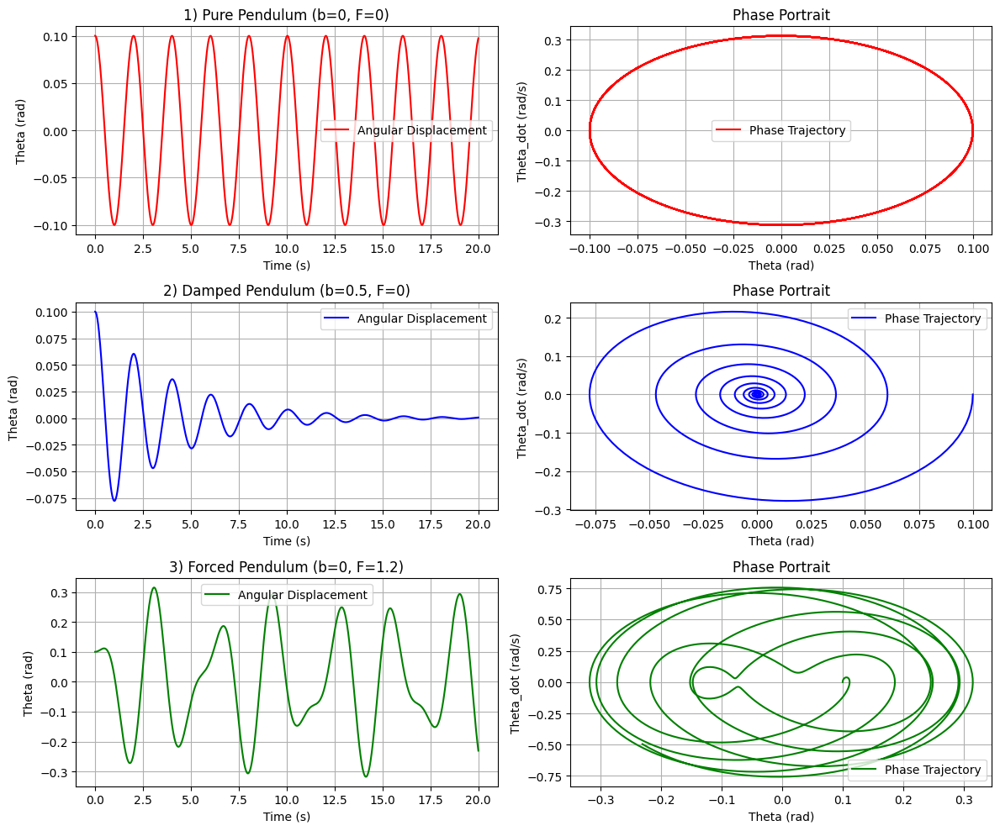
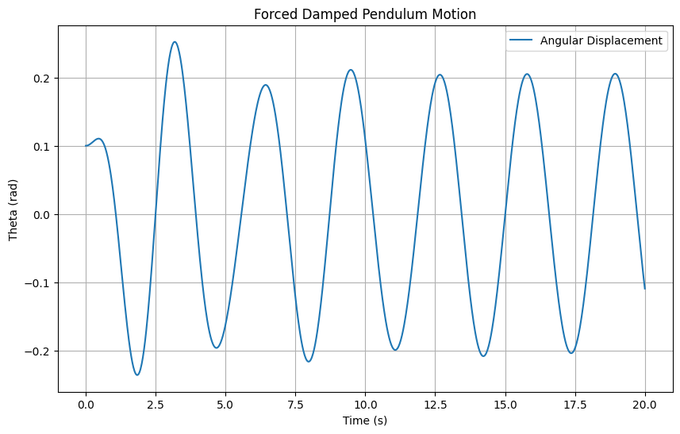
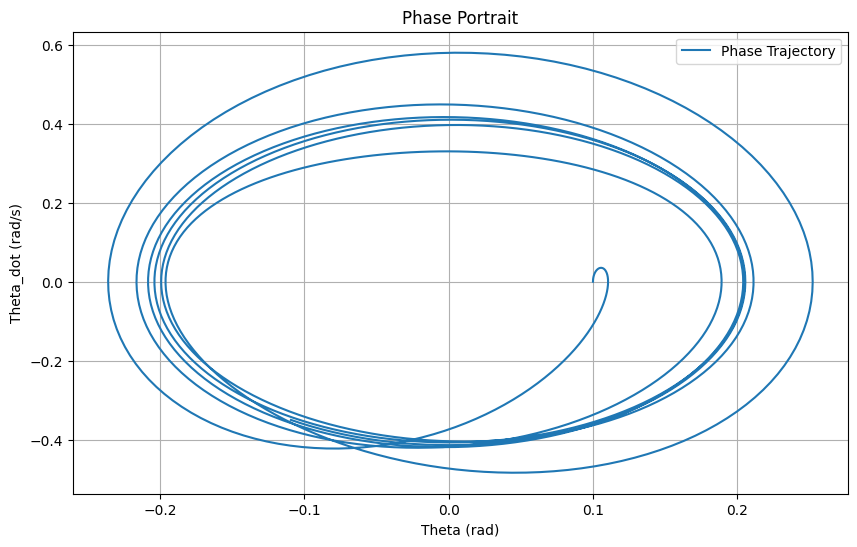

# Problem 2

## 1. Theoretical Foundation

The motion of a forced damped pendulum is governed by the following nonlinear differential equation:

$$
\frac{d^2\theta}{dt^2} + b\frac{d\theta}{dt} + \frac{g}{l}\sin(\theta) = F\cos(\omega_d t)
$$

Where:
- $\theta$ is the angular displacement,
- $b$ is the damping coefficient,
- $g$ is the gravitational acceleration (9.81 m/s²),
- $l$ is the pendulum length,
- $F$ is the amplitude of the external driving force,
- $\omega_d$ is the driving frequency,
- $t$ is time.

### Small-Angle Approximation
For small angles ($\theta \ll 1$), $\sin(\theta) \approx \theta$, simplifying the equation to a linear damped-driven oscillator:

$$
\frac{d^2\theta}{dt^2} + b\frac{d\theta}{dt} + \omega_0^2\theta = F\cos(\omega_d t)
$$

Where $\omega_0 = \sqrt{\frac{g}{l}}$ is the natural frequency. The general solution consists of a homogeneous solution (transient) and a particular solution (steady-state):

- **Homogeneous solution**: $\theta_h(t) = A e^{-\frac{b}{2}t} \cos(\omega t + \phi)$, where $\omega = \sqrt{\omega_0^2 - \left(\frac{b}{2}\right)^2}$.
- **Particular solution**: $\theta_p(t) = C \cos(\omega_d t) + D \sin(\omega_d t)$, with coefficients determined by substituting into the equation.

The steady-state amplitude exhibits resonance when $\omega_d \approx \omega_0$, maximized when $\omega_d = \sqrt{\omega_0^2 - \frac{b^2}{2}}$, amplifying energy input significantly.

## 2. Analysis of Dynamics

### Influence of Parameters
- **Damping Coefficient $ b $**: Higher $b$ reduces amplitude and prevents chaos by dissipating energy, stabilizing the system.
- **Driving Amplitude ($F$)**: Increasing $F$can push the system from periodic to chaotic motion, especially at specific frequencies.
- **Driving Frequency ($\omega_d$)**: Near $\omega_0$, resonance occurs; far from $\omega_0$, quasiperiodic or chaotic behavior emerges.

### Transition to Chaos
For large amplitudes or specific $\omega_d$ , the nonlinear $\sin(\theta)$  term dominates, leading to chaotic motion. This is observable via phase portraits and Poincaré sections, showing a shift from closed orbits (periodic) to scattered points (chaotic).

## 3. Practical Applications

- **Energy Harvesting**: Piezoelectric devices use forced oscillations to convert mechanical energy to electrical energy.
- **Suspension Bridges**: Damping and forcing model wind-induced vibrations, preventing resonance disasters (e.g., Tacoma Narrows).
- **Oscillating Circuits**: Driven RLC circuits mirror pendulum dynamics, applicable in signal processing.

## 4. Implementation

### Different Scenarios 



### Computational Model
We use the 4th-order Runge-Kutta (RK4) method to solve the nonlinear equation numerically. Below are Python scripts for simulation, visualization, and animation.

```python
import numpy as np
import matplotlib.pyplot as plt
from scipy.integrate import odeint

# Parameters
g = 9.81  # gravity (m/s^2)
l = 1.0   # length (m)
b = 0.5   # damping coefficient
F = 1.2   # driving amplitude
omega_d = 2.0  # driving frequency
omega_0 = np.sqrt(g / l)

# Differential equation
def pendulum_deriv(state, t, b, omega_0, F, omega_d):
    theta, theta_dot = state
    dtheta_dt = theta_dot
    dtheta_dot_dt = -b * theta_dot - omega_0**2 * np.sin(theta) + F * np.cos(omega_d * t)
    return [dtheta_dt, dtheta_dot_dt]

# Time array
t = np.linspace(0, 20, 1000)

# Initial conditions
theta0 = 0.1  # initial angle (rad)
theta_dot0 = 0.0  # initial angular velocity (rad/s)
state0 = [theta0, theta_dot0]

# Solve ODE
solution = odeint(pendulum_deriv, state0, t, args=(b, omega_0, F, omega_d))

# Extract results
theta = solution[:, 0]
theta_dot = solution[:, 1]

# Plotting
plt.figure(figsize=(10, 6))
plt.plot(t, theta, label='Angular Displacement')
plt.xlabel('Time (s)')
plt.ylabel('Theta (rad)')
plt.title('Forced Damped Pendulum Motion')
plt.legend()
plt.grid()
plt.show()

# Phase portrait
plt.figure(figsize=(10, 6))
plt.plot(theta, theta_dot, label='Phase Trajectory')
plt.xlabel('Theta (rad)')
plt.ylabel('Theta_dot (rad/s)')
plt.title('Phase Portrait')
plt.legend()
plt.grid()
plt.show()
```

#### Animation Script
```python
import numpy as np
import matplotlib.pyplot as plt
from matplotlib.animation import FuncAnimation
from scipy.integrate import odeint

# Parameters
g = 9.81
l = 1.0
b = 0.5
F = 1.2
omega_d = 2.0
omega_0 = np.sqrt(g / l)

# Differential equation
def pendulum_deriv(state, t, b, omega_0, F, omega_d):
    theta, theta_dot = state
    dtheta_dt = theta_dot
    dtheta_dot_dt = -b * theta_dot - omega_0**2 * np.sin(theta) + F * np.cos(omega_d * t)
    return [dtheta_dt, dtheta_dot_dt]

# Time array
t = np.linspace(0, 20, 1000)
state0 = [0.1, 0.0]
solution = odeint(pendulum_deriv, state0, t, args=(b, omega_0, F, omega_d))
theta = solution[:, 0]

# Animation setup
fig, ax = plt.subplots(figsize=(6, 6))
ax.set_xlim(-1.5, 1.5)
ax.set_ylim(-1.5, 1.5)
line, = ax.plot([], [], 'o-', lw=2)

def init():
    line.set_data([], [])
    return line,

def animate(i):
    x = l * np.sin(theta[i])
    y = -l * np.cos(theta[i])
    line.set_data([0, x], [0, y])
    return line,

ani = FuncAnimation(fig, animate, init_func=init, frames=len(t), interval=20, blit=True)
plt.title('Forced Damped Pendulum Animation')
plt.grid()
ani.save('pendulum_animation.mp4', writer='ffmpeg')
plt.show()
```




[Solutions in colab](https://colab.research.google.com/drive/1yM2VomaDAisU21e8RodixBdpF1yTNmOz?usp=sharing)


