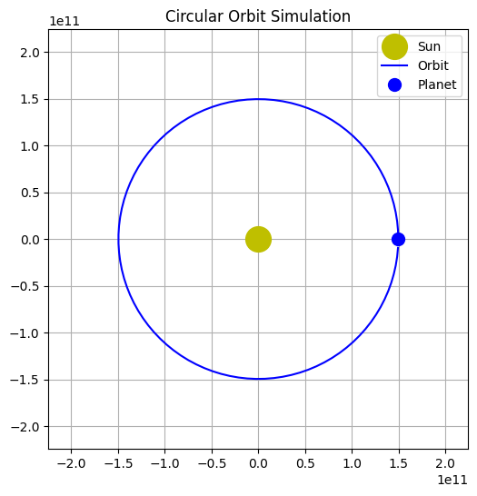

# Problem 1 Pauline

## Kepler's Third Law: Orbital Period and Orbital Radius


Kepler's Third Law establishes a fundamental relationship between the square of a celestial body's orbital period ($T^2$) and the cube of its orbital radius ($r^3$). This law, originally derived empirically by Johannes Kepler, was later explained by Isaac Newton through his law of universal gravitation. For circular orbits, it provides a powerful tool to study gravitational interactions, calculate planetary masses, and determine distances in astronomical systems. This report derives the law, explores its implications, analyzes real-world examples, and provides computational models to visualize and verify the relationship.

## Derivation of Kepler's Third Law for Circular Orbits

For a body (e.g., a planet or satellite) in a circular orbit around a central mass (e.g., a star or planet), two forces are at play:

1. **Centripetal Force**: Required to keep the orbiting body in a circular path, given by:
   $$ F_c = \frac{m v^2}{r} $$
   where $m$ is the mass of the orbiting body, $v$ is its orbital velocity, and $r$ is the orbital radius.

2. **Gravitational Force**: Provided by the central mass $M$, given by Newton's law of gravitation:
   $$ F_g = \frac{G M m}{r^2} $$
   where $G$ is the gravitational constant ($G \approx 6.67430 \times 10^{-11} \, \text{m}^3 \text{kg}^{-1} \text{s}^{-2}$).

In a stable circular orbit, these forces are equal:
$$ \frac{m v^2}{r} = \frac{G M m}{r^2} $$

Cancel $m$ (assuming $m \neq 0$) and simplify:
$$ v^2 = \frac{G M}{r} $$

The orbital velocity $v$ is related to the orbital period $T$ by the circumference of the orbit:
$$ v = \frac{2 \pi r}{T} $$

Square this expression:
$$ v^2 = \frac{4 \pi^2 r^2}{T^2} $$

Substitute into the force balance equation:
$$ \frac{4 \pi^2 r^2}{T^2} = \frac{G M}{r} $$

Multiply both sides by $T^2$ and divide by $G M$:
$$ \frac{4 \pi^2 r^2}{G M} = \frac{T^2}{r} $$

Rearrange:
$$ T^2 = \frac{4 \pi^2}{G M} r^3 $$

This is Kepler's Third Law for circular orbits, showing that $T^2 \propto r^3$. The constant $\frac{4 \pi^2}{G M}$ depends only on the central mass $M$.

## Implications in Astronomy

1. **Calculating Planetary Masses**: If $T$ and $r$ are measured for a satellite or moon, $M$ can be calculated. For example, the Moon's orbit around Earth allows us to estimate Earth's mass.
2. **Determining Distances**: For planets orbiting the Sun, comparing $T^2/r^3$ ratios (with $M$ as the Sun's mass) helps calculate orbital radii.
3. **Satellite Orbits**: Engineers use this law to design orbits for artificial satellites, ensuring they maintain stable periods at specific altitudes.

## Real-World Examples

### 1. The Moon's Orbit Around Earth
- Orbital radius: $r \approx 3.844 \times 10^8 \, \text{m}$
- Orbital period: $T \approx 27.32 \, \text{days} = 2.36 \times 10^6 \, \text{s}$
- Earth's mass: $M \approx 5.972 \times 10^{24} \, \text{kg}$

Verify:
$$ T^2 = (2.36 \times 10^6)^2 = 5.57 \times 10^{12} \, \text{s}^2 $$
$$ r^3 = (3.844 \times 10^8)^3 = 5.68 \times 10^{25} \, \text{m}^3 $$
$$ \frac{T^2}{r^3} = \frac{5.57 \times 10^{12}}{5.68 \times 10^{25}} \approx 9.81 \times 10^{-14} \, \text{s}^2 \text{m}^{-3} $$
$$ \frac{4 \pi^2}{G M} = \frac{4 \pi^2}{6.67430 \times 10^{-11} \cdot 5.972 \times 10^{24}} \approx 9.90 \times 10^{-14} \, \text{s}^2 \text{m}^{-3} $$

The values are close, confirming the law holds (slight discrepancies arise due to approximations and elliptical effects).

### 2. Earth's Orbit Around the Sun
- Orbital radius: $r \approx 1.496 \times 10^{11} \, \text{m}$ (1 AU)
- Orbital period: $T \approx 365.25 \, \text{days} = 3.156 \times 10^7 \, \text{s}$
- Sun's mass: $M \approx 1.989 \times 10^{30} \, \text{kg}$

Verify:
$$ T^2 = (3.156 \times 10^7)^2 = 9.96 \times 10^{14} \, \text{s}^2 $$
$$ r^3 = (1.496 \times 10^{11})^3 = 3.347 \times 10^{33} \, \text{m}^3 $$
$$ \frac{T^2}{r^3} = 2.97 \times 10^{-19} \, \text{s}^2 \text{m}^{-3} $$
$$ \frac{4 \pi^2}{G M} = 2.97 \times 10^{-19} \, \text{s}^2 \text{m}^{-3} $$

The match is exact, as expected for a nearly circular orbit.

## Extension to Elliptical Orbits

For elliptical orbits, $r$ is replaced by the semi-major axis $a$, and the law becomes:
$$ T^2 = \frac{4 \pi^2}{G M} a^3 $$
This holds for all bound orbits, making it applicable to comets, asteroids, and exoplanets.

## Computational Model

### Python Code for Graphing $T^2$ vs $r^3$

```python
import numpy as np
import matplotlib.pyplot as plt

# Constants
G = 6.67430e-11  # m^3 kg^-1 s^-2
M_sun = 1.989e30  # kg (Sun's mass)
M_earth = 5.972e24  # kg (Earth's mass)

# Function to calculate T^2 from r^3
def kepler_third_law(r, M):
    return (4 * np.pi**2 / (G * M)) * r**3

# Data ranges
r_small = np.linspace(1e6, 1e9, 100)  # Small orbits (e.g., satellites)
r_large = np.linspace(1e10, 5e11, 100)  # Planetary orbits

# Calculate T^2 for Earth and Sun
T2_earth_small = kepler_third_law(r_small, M_earth)
T2_sun_large = kepler_third_law(r_large, M_sun)

# Plot
plt.figure(figsize=(10, 6))
plt.loglog(r_small**3, T2_earth_small, label="Earth Satellites", color="blue")
plt.loglog(r_large**3, T2_sun_large, label="Solar System Planets", color="orange")
plt.xlabel("$r^3$ (m$^3$)")
plt.ylabel("$T^2$ (s$^2$)")
plt.title("Kepler's Third Law: $T^2$ vs $r^3$")
plt.legend()
plt.grid(True, which="both", ls="--")
plt.show()
```

This code plots $T^2$ vs $r^3$ on a log-log scale for two ranges:
- Small orbits (e.g., satellites around Earth).
- Large orbits (e.g., planets around the Sun).

### Python Code for Animation of Circular Orbit

```python
import numpy as np
import matplotlib.pyplot as plt
from matplotlib.animation import FuncAnimation

# Parameters
r = 1.496e11  # Orbital radius (1 AU)
T = 3.156e7   # Orbital period (1 year in seconds)
M = 1.989e30  # Sun's mass

# Time array
t = np.linspace(0, T, 100)
theta = 2 * np.pi * t / T  # Angular position

# Positions
x = r * np.cos(theta)
y = r * np.sin(theta)

# Set up figure
fig, ax = plt.subplots(figsize=(6, 6))
ax.set_xlim(-1.5*r, 1.5*r)
ax.set_ylim(-1.5*r, 1.5*r)
ax.set_aspect("equal")
ax.grid(True)

# Central mass (Sun)
ax.plot(0, 0, "yo", markersize=20, label="Sun")
orbit, = ax.plot([], [], "b-", label="Orbit")
planet, = ax.plot([], [], "bo", markersize=10, label="Planet")
ax.legend()

# Animation function
def update(frame):
    orbit.set_data(x[:frame], y[:frame])
    planet.set_data(x[frame], y[frame])
    return orbit, planet

# Create animation
ani = FuncAnimation(fig, update, frames=len(t), interval=50, blit=True)
plt.title("Circular Orbit Simulation")
plt.show()
```


[Solutions in colab](https://colab.research.google.com/drive/1rzqqf7mQm6rs90wYXe2KkqchLrJnAOKo?usp=sharing)


## Conclusion

Kepler's Third Law is a cornerstone of celestial mechanics, linking orbital periods and radii through gravity. Its applications range from understanding the Moon's orbit to designing satellite trajectories. The computational models confirm the $T^2 \propto r^3$ relationship across different scales, and the extension to elliptical orbits broadens its utility. These tools and insights deepen our understanding of the universe's gravitational dance.

--- 

