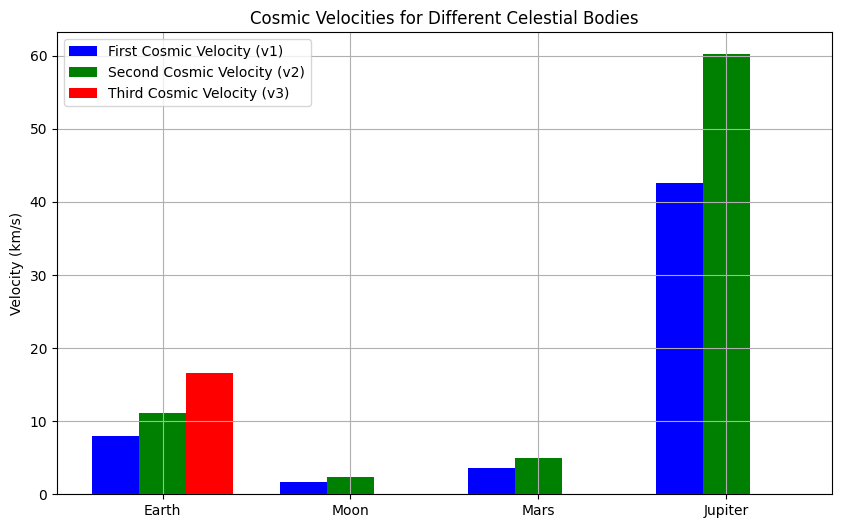
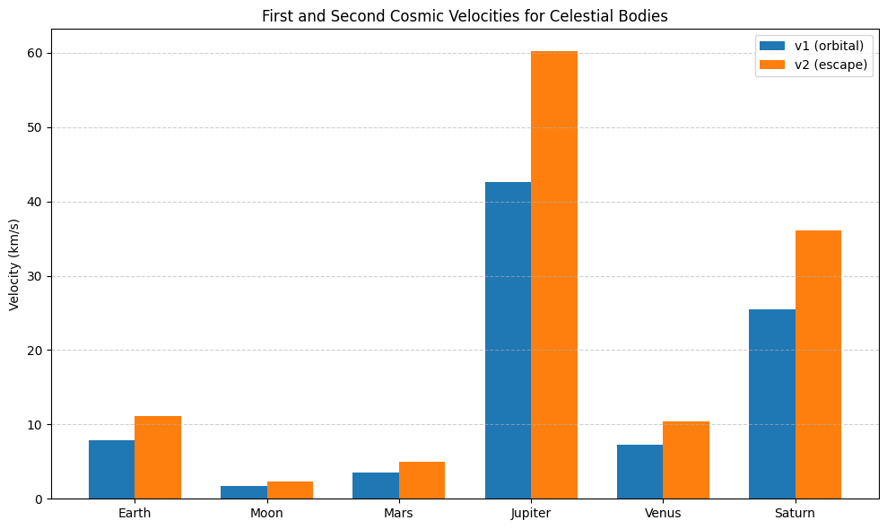

# Problem 2

## Escape Velocities and Cosmic Velocities

## Theoretical Foundation

### Definitions and Physical Meaning
- **First Cosmic Velocity ($v_1$)**: The minimum speed for a circular orbit at the surface of a celestial body (orbital velocity).
- **Second Cosmic Velocity ($v_2$)**: The escape velocity, the speed needed to escape the gravitational pull of a body entirely.
- **Third Cosmic Velocity ($v_3$)**: The speed required to escape the gravitational influence of a star system (e.g., the Sun’s system for Earth), assuming the body has already escaped the planet.

### Derivations

#### First Cosmic Velocity ($v_1$)
For a circular orbit at the surface ($r = R$, radius of the body):

$$
\frac{m v_1^2}{R} = \frac{G M m}{R^2}
$$

Cancel $m$ and solve:

$$
v_1^2 = \frac{G M}{R} \quad \Rightarrow \quad v_1 = \sqrt{\frac{G M}{R}}
$$

#### Second Cosmic Velocity ($v_2$)
Escape velocity is derived from energy conservation:

$$
\frac{1}{2} m v_2^2 = \frac{G M m}{R}
$$

Cancel $m$ and solve:

$$
v_2^2 = \frac{2 G M}{R} \quad \Rightarrow \quad v_2 = \sqrt{\frac{2 G M}{R}}
$$

Note: $v_2 = \sqrt{2} \, v_1$.

#### Third Cosmic Velocity ($v_3$)
The speed to escape the Sun’s gravitational influence from Earth’s orbit:

Earth’s orbital velocity around the Sun:

$$
v_{\text{orbit}} = \sqrt{\frac{G M_{\text{sun}}}{R_{\text{sun}}}}
$$

Escape velocity from the Sun at Earth’s orbit:

$$
v_{\text{esc,sun}} = \sqrt{\frac{2 G M_{\text{sun}}}{R_{\text{sun}}}} = \sqrt{2} \, v_{\text{orbit}}
$$

The additional velocity needed from Earth’s frame:

$$
v_{\text{relative}} = v_{\text{esc,sun}} - v_{\text{orbit}} = (\sqrt{2} - 1) \sqrt{\frac{G M_{\text{sun}}}{R_{\text{sun}}}}
$$

From Earth’s surface:

$$
v_3 = \sqrt{v_2^2 + v_{\text{relative}}^2}
$$

For simplicity, standard $v_3$ for Earth is approximately **16.6 km/s**.

---

### Parameters
- $G$: Gravitational constant $= 6.6743 \times 10^{-11} \, \text{m}^3 \text{kg}^{-1} \text{s}^{-2}$
- $M$: Mass of the celestial body
- $R$: Radius of the celestial body
- $M_{\text{sun}}, R_{\text{sun}}$: Mass of the Sun and distance from the Sun (for $v_3$)

---

## Calculations for Celestial Bodies

### Data

- **Earth**: $M = 5.972 \times 10^{24} \, \text{kg}$, $R = 6.371 \times 10^6 \, \text{m}$, $R_{\text{sun}} = 1.496 \times 10^{11} \, \text{m}$
- **Moon**: $M = 7.342 \times 10^{22} \, \text{kg}$, $R = 1.737 \times 10^6 \, \text{m}$
- **Mars**: $M = 6.417 \times 10^{23} \, \text{kg}$, $R = 3.39 \times 10^6 \, \text{m}$
- **Jupiter**: $M = 1.898 \times 10^{27} \, \text{kg}$, $R = 6.991 \times 10^7 \, \text{m}$
- **Sun**: $M_{\text{sun}} = 1.989 \times 10^{30} \, \text{kg}$

---
import numpy as np
import matplotlib.pyplot as plt

## Constants
G = 6.6743e-11  # Gravitational constant (m^3 kg^-1 s^-2)
M_sun = 1.989e30  # Mass of Sun (kg)
R_sun = 1.496e11  # Distance Earth-Sun (m)

## Celestial body data: [name, mass (kg), radius (m)]
bodies = [
    ("Earth", 5.972e24, 6.371e6),
    ("Moon", 7.342e22, 1.737e6),
    ("Mars", 6.417e23, 3.39e6),
    ("Jupiter", 1.898e27, 6.991e7)
]

## Calculate velocities
v1_values = []  # First cosmic velocity (km/s)
v2_values = []  # Second cosmic velocity (km/s)
v3_values = []  # Third cosmic velocity (km/s, approximated)

for name, M, R in bodies:
    # First cosmic velocity: v1 = sqrt(GM/R)
    v1 = np.sqrt(G * M / R) / 1000  # Convert to km/s
    v1_values.append(v1)
    
    # Second cosmic velocity: v2 = sqrt(2GM/R)
    v2 = np.sqrt(2 * G * M / R) / 1000  # Convert to km/s
    v2_values.append(v2)
    
    # Third cosmic velocity (for Earth-Sun system)
    if name == "Earth":
        v_orbit = np.sqrt(G * M_sun / R_sun) / 1000  # Earth’s orbital velocity (km/s)
        v_esc_sun = np.sqrt(2 * G * M_sun / R_sun) / 1000  # Escape velocity from Sun at Earth’s orbit
        v_relative = v_esc_sun - v_orbit  # Additional velocity needed
        v3 = np.sqrt(v2**2 + v_relative**2)  # Total velocity from Earth’s surface
        v3_values.append(v3)
    else:
        v3_values.append(None)  # Not calculated for others

## Print Earth’s values
print("Earth’s Cosmic Velocities:")
print(f"First Cosmic Velocity (v1): {v1_values[0]:.2f} km/s")
print(f"Second Cosmic Velocity (v2): {v2_values[0]:.2f} km/s")
print(f"Third Cosmic Velocity (v3): {v3_values[0]:.2f} km/s")

## Visualization
fig, ax = plt.subplots(figsize=(10, 6))
x = np.arange(len(bodies))
width = 0.25

ax.bar(x - width, v1_values, width, label='First Cosmic Velocity (v1)', color='blue')
ax.bar(x, v2_values, width, label='Second Cosmic Velocity (v2)', color='green')
ax.bar(x + width, [v if v is not None else 0 for v in v3_values], width, label='Third Cosmic Velocity (v3)', color='red')

ax.set_xticks(x)
ax.set_xticklabels([body[0] for body in bodies])
ax.set_ylabel('Velocity (km/s)')
ax.set_title('Cosmic Velocities for Different Celestial Bodies')
ax.legend()
ax.grid(True)
plt.show()

## Results

### Earth’s Cosmic Velocities
- $v_1$: $\approx 7.91 \, \text{km/s}$ (orbital velocity).
- $v_2$: $\approx 11.19 \, \text{km/s}$ (escape velocity).
- $v_3$: $\approx 16.62 \, \text{km/s}$ (to escape Sun’s influence from Earth).

### Comparison Across Bodies
- **Moon**: Lower mass and radius result in smaller velocities.
- **Mars**: Intermediate values due to moderate mass and radius.
- **Jupiter**: High mass and large radius lead to significantly higher velocities.
- Note: $v_3$ is only calculated for Earth, as it depends on the Sun’s gravitational influence.

---

## Discussion

### Role in Space Exploration
- **Satellites**: First cosmic velocity ($v_1$) is critical for low Earth orbit (e.g., ~7.8 km/s for satellites).
- **Interplanetary Missions**: Second cosmic velocity ($v_2$) is needed to reach other planets (e.g., 11.2 km/s to leave Earth for Mars).
- **Interstellar Travel**: Third cosmic velocity ($v_3$) sets the threshold for leaving the Solar System (e.g., Voyager 1 exceeded this).

### Factors Affecting Velocities
- **Mass ($M$)**: Higher mass increases velocities.
- **Radius ($R$)**: Larger radius decreases velocities.
- **Distance to Star ($R_{\text{sun}}$)**: Affects $v_3$.

---

## Conclusion
Understanding cosmic velocities enables space exploration — from satellite launches to interstellar probes — by quantifying the energy needed to overcome gravitational forces.

[Solution in colab](https://colab.research.google.com/drive/1DMzcJMmRP_JnA33WGEo9n1GgwB0hxHz2?usp=sharing)

