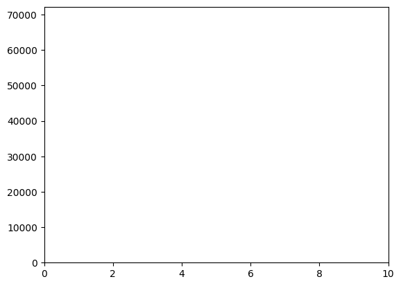

# Problem 2

**Escape Velocities and Cosmic Velocities**

## Motivation
The concept of escape velocity is crucial for understanding the conditions required to leave a celestial body's gravitational influence. Extending this concept, the first, second, and third cosmic velocities define the thresholds for orbiting, escaping, and leaving a star system. These principles underpin modern space exploration, from launching satellites to interplanetary missions.

## Definitions

### First Cosmic Velocity

The first cosmic velocity $$ v_1 $$is the minimum velocity required for an object to maintain a stable circular orbit around a celestial body. It is given by:
$$ v_1 = \sqrt{\frac{GM}{R}} $$
where:
- $ G $ is the gravitational constant $ 6.674 \times 10^{-11} \, m^3 kg^{-1} s^{-2} $
- $ M $ is the mass of the celestial body
- $ R $ is the radius of the celestial body

### Second Cosmic Velocity (Escape Velocity)
The second cosmic velocity $ v_2 $ is the minimum velocity required for an object to escape a celestial body's gravitational influence without further propulsion. It is given by:
$$ v_2 = \sqrt{2GM/R} $$

### Third Cosmic Velocity
The third cosmic velocity $ v_3 $ is the velocity required for an object to escape the Sun's gravitational influence from a given planet’s orbit. It is given by:
$$ v_3 = \sqrt{v_2^2 + v_{orb}^2} $$
where $ v_{orb} $ is the orbital velocity of the planet around the Sun.

## Calculations for Earth, Mars, and Jupiter

Using standard values:
- Earth: $ M = 5.972 \times 10^{24} $ kg, $ R = 6371 $ km
- Mars: $ M = 6.417 \times 10^{23} $ kg, $ R = 3389 $ km
- Jupiter: $ M = 1.898 \times 10^{27} $ kg, $ R = 69911 $ km

## Python Code for Graphs
```python
import numpy as np
import matplotlib.pyplot as plt

# Constants
G = 6.674e-11  # Gravitational constant (m^3 kg^-1 s^-2)

# Celestial bodies data
bodies = {
    "Earth": {"M": 5.972e24, "R": 6371e3},
    "Mars": {"M": 6.417e23, "R": 3389e3},
    "Jupiter": {"M": 1.898e27, "R": 69911e3}
}

# Compute velocities
velocities = {}
for body, data in bodies.items():
    M, R = data["M"], data["R"]
    v1 = np.sqrt(G * M / R)
    v2 = np.sqrt(2 * G * M / R)
    velocities[body] = (v1, v2)

# Plot results
labels = list(velocities.keys())
v1_values = [vel[0] for vel in velocities.values()]
v2_values = [vel[1] for vel in velocities.values()]

x = np.arange(len(labels))
width = 0.4
plt.figure(figsize=(8,6))
plt.bar(x - width/2, v1_values, width, label="First Cosmic Velocity")
plt.bar(x + width/2, v2_values, width, label="Escape Velocity")
plt.xlabel("Celestial Bodies")
plt.ylabel("Velocity (m/s)")
plt.xticks(x, labels)
plt.legend()
plt.title("First and Second Cosmic Velocities for Planets")
plt.grid(axis='y', linestyle='--', alpha=0.7)
plt.show()
```


## Python Code for Animation
```python
import matplotlib.animation as animation
fig, ax = plt.subplots()
ax.set_xlim(0, 10)
ax.set_ylim(0, max(v2_values) * 1.2)
line, = ax.plot([], [], 'ro', markersize=8)

def update(frame):
    line.set_data(frame, v2_values[frame % len(v2_values)])
    return line,

ani = animation.FuncAnimation(fig, update, frames=len(v2_values), interval=1000, repeat=True)
plt.show()
```



## Importance in Space Exploration
1. **Satellite Deployment**: Understanding $ v_1 $ helps engineers design stable satellite orbits.
2. **Interplanetary Missions**: Calculating $ v_2 $ ensures spacecraft can leave planetary influence.
3. **Interstellar Travel**: $ v_3 $ is crucial for designing missions beyond our solar system.

[Solution in colab](https://colab.research.google.com/drive/1DMzcJMmRP_JnA33WGEo9n1GgwB0hxHz2?usp=sharing)

