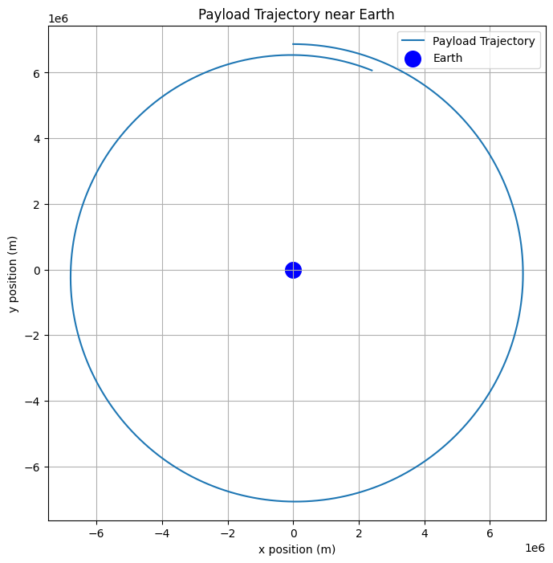
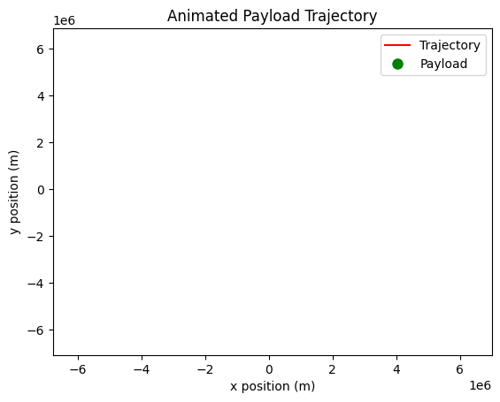

# Problem 3

**Trajectories of a Freely Released Payload Near Earth**

## Motivation
When an object is released from a moving rocket near Earth, its trajectory depends on initial conditions and gravitational forces. This scenario presents a rich problem, blending principles of orbital mechanics and numerical methods. Understanding the potential trajectories is vital for space missions, such as deploying payloads or returning objects to Earth.

## Types of Trajectories
The possible trajectories of a payload are determined by its velocity relative to Earth:
1. **Elliptical Orbit (Bound Trajectory):** If the payload's velocity is below escape velocity but high enough to avoid reentry, it will enter an elliptical orbit.
2. **Parabolic Trajectory (Escape Condition):** If the velocity equals the escape velocity, the object follows a parabolic path and eventually leaves Earth's gravity.
3. **Hyperbolic Trajectory (Unbound Escape):** If the velocity exceeds escape velocity, the payload follows a hyperbolic trajectory and escapes Earth's gravitational influence.
4. **Reentry Trajectory:** If the velocity is too low or directed towards Earth, the payload will reenter the atmosphere and crash.

### Governing Equations
Newton’s Law of Gravitation governs the motion:
$$ F = \frac{GMm}{r^2} $$

The equation of motion in two dimensions:
$$ \frac{d^2r}{dt^2} = -\frac{GM}{r^2} \hat{r} $$

where:
- $ G $ is the gravitational constant $ 6.674 \times 10^{-11} \, m^3 kg^{-1} s^{-2} $
- $ M $ is the mass of the Earth $ 5.972 \times 10^{24} $ kg
- $ r $ is the distance of the payload from Earth's center

## Python Code for Trajectory Simulation

```python
import numpy as np
import matplotlib.pyplot as plt
from scipy.integrate import solve_ivp

# Constants
G = 6.674e-11  # Gravitational constant (m^3 kg^-1 s^-2)
M = 5.972e24   # Mass of Earth (kg)
R_Earth = 6371e3  # Earth's radius (m)

# Function defining the equations of motion
def equations(t, state):
    x, y, vx, vy = state
    r = np.sqrt(x**2 + y**2)
    ax = -G * M * x / r**3
    ay = -G * M * y / r**3
    return [vx, vy, ax, ay]

# Initial conditions (altitude, velocity components)
x0, y0 = 0, R_Earth + 500000  # 500 km altitude
vx0, vy0 = 7700, 0  # Initial velocity (m/s), varies per scenario

# Time span for simulation
t_span = (0, 6000)  # 6000 seconds simulation
t_eval = np.linspace(*t_span, num=1000)

# Solve the ODE
sol = solve_ivp(equations, t_span, [x0, y0, vx0, vy0], t_eval=t_eval, method='RK45')

# Extract results
x, y = sol.y[0], sol.y[1]

# Plot the trajectory
plt.figure(figsize=(8, 8))
plt.plot(x, y, label='Payload Trajectory')
plt.scatter(0, 0, color='blue', label='Earth', s=200)
plt.xlabel('x position (m)')
plt.ylabel('y position (m)')
plt.title('Payload Trajectory near Earth')
plt.legend()
plt.grid()
plt.axis('equal')
plt.show()
```


## Python Code for Animation
```python
import matplotlib.animation as animation
fig, ax = plt.subplots()
ax.set_xlim(min(x), max(x))
ax.set_ylim(min(y), max(y))
ax.set_xlabel("x position (m)")
ax.set_ylabel("y position (m)")
ax.set_title("Animated Payload Trajectory")
trajectory, = ax.plot([], [], 'r-', label='Trajectory')
payload, = ax.plot([], [], 'go', markersize=8, label='Payload')

def update(frame):
    trajectory.set_data(x[:frame], y[:frame])
    payload.set_data(x[frame], y[frame])
    return trajectory, payload

ani = animation.FuncAnimation(fig, update, frames=len(x), interval=20, repeat=False)
plt.legend()
plt.show()
```


## Real-World Applications
1. **Satellite Deployment:** Ensuring a stable orbit for communication and research satellites.
2. **Spacecraft Reentry:** Understanding reentry trajectories for safe returns.
3. **Interplanetary Travel:** Planning escape velocities for missions beyond Earth.


