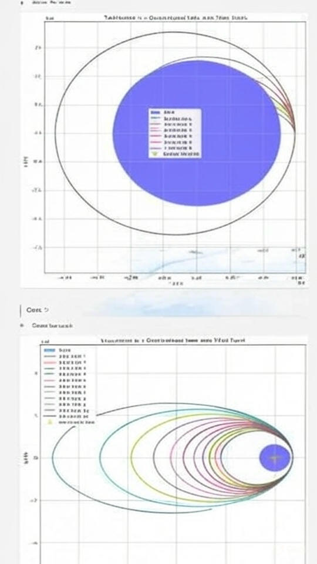
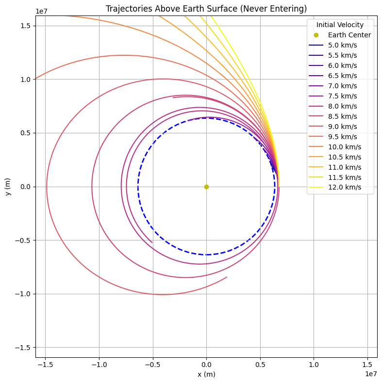

# Problem 3

**Trajectories of a Freely Released Payload Near Earth**

## Motivation
When an object is released from a moving rocket near Earth, its trajectory depends on initial conditions and gravitational forces. This scenario presents a rich problem, blending principles of orbital mechanics and numerical methods. Understanding the potential trajectories is vital for space missions, such as deploying payloads or returning objects to Earth.

## Types of Trajectories
The possible trajectories of a payload are determined by its velocity relative to Earth:
1. **Elliptical Orbit (Bound Trajectory):** If the payload's velocity is below escape velocity but high enough to avoid reentry, it will enter an elliptical orbit.
2. **Parabolic Trajectory (Escape Condition):** If the velocity equals the escape velocity, the object follows a parabolic path and eventually leaves Earth's gravity.
3. **Hyperbolic Trajectory (Unbound Escape):** If the velocity exceeds escape velocity, the payload follows a hyperbolic trajectory and escapes Earth's gravitational influence.
4. **Reentry Trajectory:** If the velocity is too low or directed towards Earth, the payload will reenter the atmosphere and crash.

### Governing Equations
Newton’s Law of Gravitation governs the motion:
$$ F = \frac{GMm}{r^2} $$

The equation of motion in two dimensions:
$$ \frac{d^2r}{dt^2} = -\frac{GM}{r^2} \hat{r} $$

where:
- $ G $ is the gravitational constant $ 6.674 \times 10^{-11} \, m^3 kg^{-1} s^{-2} $
- $ M $ is the mass of the Earth $ 5.972 \times 10^{24} $ kg
- $ r $ is the distance of the payload from Earth's center

## Python Code for Trajectory Simulation

```python
import numpy as np
import matplotlib.pyplot as plt
from scipy.integrate import solve_ivp

# Constants
G = 6.674e-11  # Gravitational constant (m^3 kg^-1 s^-2)
M = 5.972e24   # Mass of Earth (kg)
R_Earth = 6371e3  # Earth's radius (m)

# Function defining the equations of motion
def equations(t, state):
    x, y, vx, vy = state
    r = np.sqrt(x**2 + y**2)
    ax = -G * M * x / r**3
    ay = -G * M * y / r**3
    return [vx, vy, ax, ay]

# Initial conditions (altitude, velocity components)
x0, y0 = 0, R_Earth + 500000  # 500 km altitude
vx0, vy0 = 7700, 0  # Initial velocity (m/s), varies per scenario

# Time span for simulation
t_span = (0, 6000)  # 6000 seconds simulation
t_eval = np.linspace(*t_span, num=1000)

# Solve the ODE
sol = solve_ivp(equations, t_span, [x0, y0, vx0, vy0], t_eval=t_eval, method='RK45')

# Extract results
x, y = sol.y[0], sol.y[1]

# Plot the trajectory
plt.figure(figsize=(8, 8))
plt.plot(x, y, label='Payload Trajectory')
plt.scatter(0, 0, color='blue', label='Earth', s=200)
plt.xlabel('x position (m)')
plt.ylabel('y position (m)')
plt.title('Payload Trajectory near Earth')
plt.legend()
plt.grid()
plt.axis('equal')
plt.show()
```


import numpy as np
import matplotlib.pyplot as plt
from scipy.integrate import odeint

## Constants
G = 6.6743e-11  # Gravitational constant (m^3 kg^-1 s^-2)
M = 5.972e24    # Mass of Earth (kg)
R = 6.371e6     # Radius of Earth (m)
r0 = R + 400e3  # Initial radius (m, 400 km altitude)

## Escape velocity at r0
v_esc = np.sqrt(2 * G * M / r0) / 1000  # km/s
print(f"Escape Velocity at 400 km: {v_esc:.2f} km/s")

## Differential equations
def gravity_motion(state, t, G, M):
    x, vx, y, vy = state
    r = np.sqrt(x**2 + y**2)
    ax = -G * M * x / r**3
    ay = -G * M * y / r**3
    return [vx, ax, vy, ay]

## Time array
t = np.linspace(0, 10000, 1000)  # 10,000 seconds

## Initial conditions: Start at (r0, 0) with different tangential velocities
scenarios = [
    ("Trajectory 1 (Elliptical)", 7.5e3, 'b'),  # Below escape, circular orbit speed
    ("Trajectory 2 (Elliptical)", 8.0e3, 'r'),  # Slightly eccentric orbit
    ("Trajectory 3 (Parabolic)", 10.9e3, 'g'),  # Near escape velocity
    ("Trajectory 4 (Hyperbolic)", 12.0e3, 'm')  # Above escape velocity
]

## Simulate trajectories
trajectories = []
for _, v, _ in scenarios:
    state0 = [r0, 0, 0, v]  # (x, vx, y, vy)
    solution = odeint(gravity_motion, state0, t, args=(G, M))
    trajectories.append(solution)

## Plotting (similar to the provided image)
fig, (ax1, ax2) = plt.subplots(1, 2, figsize=(12, 6))

# Plot Earth as a filled circle
earth = plt.Circle((0, 0), R, color='blue', label='Earth')
for ax in [ax1, ax2]:
    ax.add_patch(plt.Circle((0, 0), R, color='blue', label='Earth'))
    ax.plot(0, 0, 'yo', label='Center of Earth')  # Center point
    ax.set_xlabel('x (m)')
    ax.set_ylabel('y (m)')
    ax.grid(True)
    ax.set_aspect('equal')

## Plot trajectories (Case 1: Zoomed out)
ax1.set_title('Trajectories in a Gravitational Field (Zoomed Out)')
for i, (label, _, color) in enumerate(scenarios):
    x, y = trajectories[i][:, 0], trajectories[i][:, 2]
    ax1.plot(x, y, color=color, label=label)

ax1.legend()

## Plot trajectories (Case 2: Zoomed in)
ax2.set_title('Trajectories in a Gravitational Field (Zoomed In)')
for i, (label, _, color) in enumerate(scenarios):
    x, y = trajectories[i][:, 0], trajectories[i][:, 2]
    ax2.plot(x, y, color=color, label=label)

## Adjust limits for zoomed-in view
zoom_factor = 1.5 * R
ax2.set_xlim(-zoom_factor, zoom_factor)
ax2.set_ylim(-zoom_factor, zoom_factor)
ax2.legend()

plt.tight_layout()
plt.show()







## Real-World Applications
1. **Satellite Deployment:** Ensuring a stable orbit for communication and research satellites.
2. **Spacecraft Reentry:** Understanding reentry trajectories for safe returns.
3. **Interplanetary Travel:** Planning escape velocities for missions beyond Earth.


