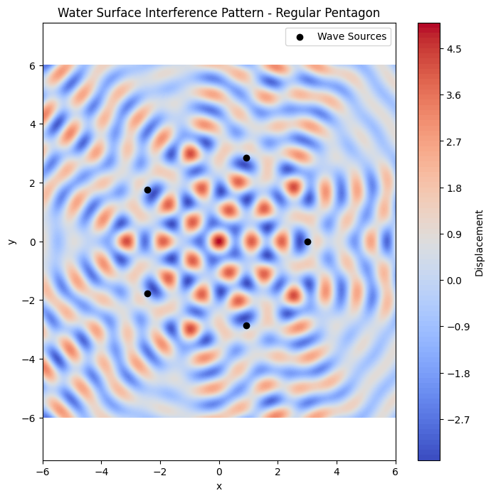

# Problem 1

**Interference Patterns on a Water Surface**

## **Fundamentals of Waves**
- **Amplitude (A)**: The maximum displacement from equilibrium.
- **Wavelength ($$ \lambda $$)**: The distance between successive crests.
- **Wave number ($$ k $$)**: $$ k = \frac{2\pi}{\lambda} $$
- **Frequency (f)**: The number of oscillations per unit time.
- **Angular frequency ($$ \omega $$)**: $$ \omega = 2\pi f $$
- **Phase ($$ \phi $$)**: Describes the wave's shift at a point.

A single disturbance from a point source is modeled as:

$$ u_i(x, y, t) = A \cos(k r_i - \omega t + \phi) $$

where $$ r_i = \sqrt{(x - x_i)^2 + (y - y_i)^2} $$ is the distance from the $$ i $$-th source to point $$ (x, y) $$.

The total displacement at point $$ (x, y) $$ is:

$$ U(x, y, t) = \sum_{i=1}^{N} A \cos(k r_i - \omega t + \phi) $$

---

## **Numerical Parameters and Calculations**
Let's assume the following values:
- Amplitude: $$ A = 1.0 $$
- Wavelength: $$ \lambda = 1.0 \Rightarrow k = \frac{2\pi}{1} = 6.2832 $$
- Frequency: $$ f = 1.0 \Rightarrow \omega = 2\pi f = 6.2832 $$
- Initial Phase: $$ \phi = 0 $$
- Radius of the polygon: 3 units

Each wave source is described by:

$$ u_i(x, y, t) = \cos(6.2832 \cdot r_i - 6.2832 \cdot t) $$

where $$ r_i $$ is the distance from each source at the vertex of the pentagon.

The resulting wave field is the sum of all five such terms.

---

## Python Code
```python
import numpy as np
import matplotlib.pyplot as plt
import matplotlib.animation as animation

# Wave parameters
A = 1.0                 # Amplitude
wavelength = 1.0        # Wavelength
k = 2 * np.pi / wavelength  # Wave number
f = 1.0                 # Frequency
omega = 2 * np.pi * f   # Angular frequency
phi = 0                 # Initial phase

# Define the regular polygon (pentagon)
def regular_polygon(n_sides, radius=3):
    return [(radius * np.cos(2 * np.pi * i / n_sides),
             radius * np.sin(2 * np.pi * i / n_sides)) for i in range(n_sides)]

sources = regular_polygon(5)  # 5 for pentagon

# Define the grid
x = np.linspace(-6, 6, 500)
y = np.linspace(-6, 6, 500)
X, Y = np.meshgrid(x, y)

# Superposition function
def wave_interference(x, y, sources, t):
    result = np.zeros_like(x)
    for (x0, y0) in sources:
        r = np.sqrt((x - x0)**2 + (y - y0)**2)
        result += A * np.cos(k * r - omega * t + phi)
    return result

# Static Plot at t = 0
Z = wave_interference(X, Y, sources, 0)

plt.figure(figsize=(8, 8))
plt.contourf(X, Y, Z, levels=100, cmap='coolwarm')
plt.colorbar(label='Displacement')
plt.scatter(*zip(*sources), color='black', label='Wave Sources')
plt.legend()
plt.title('Water Surface Interference Pattern - Regular Pentagon')
plt.xlabel('x')
plt.ylabel('y')
plt.axis('equal')
plt.show()
```



[Visuals in google colab](https://colab.research.google.com/drive/16j1U8vgwDN_99xQtginwrxq5wN2O1-q3?usp=sharing)

## Observations
- **Constructive Interference**: Bright/red regions where waves reinforce.
- **Destructive Interference**: Dark/blue regions where waves cancel.

## Numerical Parameters and Calculations

- **Amplitude**: $$ A = 1.0 $$
- **Wavelength**: $$ \lambda = 1.0 \Rightarrow k = \frac{2\pi}{\lambda} = \frac{2\pi}{1.0} = 6.2832 $$
- **Frequency**: $$ f = 1.0 \Rightarrow \omega = 2\pi f = 6.2832 $$
- **Initial Phase**: $$ \phi = 0 $$
- **Polygon Radius**: $$ R = 3 $$ units (distance from center to each vertex)

---

### **Step-by-Step Example**

Let’s compute the displacement at point $$ (x, y) = (0, 0) $$ at time $$ t = 0 $$ from one source located at $$ (x_1, y_1) = (3, 0) $$ (one vertex of the pentagon):

1. **Distance from source**:

   $$
   r_1 = \sqrt{(x - x_1)^2 + (y - y_1)^2} = \sqrt{(0 - 3)^2 + (0 - 0)^2} = 3
   $$

2. **Wave contribution from that source**:

   $$
   u_1 = A \cos(k r_1 - \omega t + \phi) = \cos(6.2832 \cdot 3 - 6.2832 \cdot 0 + 0) = \cos(18.8496) \approx -1
   $$

3. ## all 5 vertices, and sum:

   $$
   U(0, 0, 0) = \sum_{i=1}^{5} \cos(6.2832 \cdot r_i)
   $$

 **wave contributions from each of the 5 pentagon vertices** to the point at the center of the polygon, i.e., $ (x, y) = (0, 0) $, at time $ t = 0 $.

---

### Step-by-Step Calculation at Point (0, 0), Time $t = 0 $

- Amplitude $ A = 1.0 $
- Wavelength $ \lambda = 1.0 \Rightarrow k = \frac{2\pi}{\lambda} = 6.2832 $
- Frequency $ f = 1.0 \Rightarrow \omega = 2\pi f = 6.2832 $
- Phase $ \phi = 0 $
- Radius of pentagon: $ R = 3 $

---

## Vertex Coordinates of Pentagon
The 5 vertices of a regular pentagon centered at the origin, with radius 3 units:

| Vertex | $ x_i $     | $ y_i $     |
|--------|---------------|---------------|
| 1      | $ 3.0000 $    |   $ 0.0000 $|
| 2      | $ 0.9270 $    |   $ 2.8532 $|
| 3      | $ -2.4271 $   | $ 1.7634 $  |
| 4      | $ -2.4271 $   | $ -1.7634 $ |
| 5      | $ 0.9270 $    | $ -2.8532 $ |

---

## Distance to (0, 0) from Each Vertex:

We compute:

 $ r_i = \sqrt{x_i^2 + y_i^2} $

Since all points are exactly 3 units from the center, we have:

$r_1 = r_2 = r_3 = r_4 = r_5 = 3$
---

## Wave Contribution from Each Source

Using:

$
u_i = \cos(k r_i - \omega t + \phi) = \cos(6.2832 \cdot 3 - 0 + 0) = \cos(18.8496)$

$
\cos(18.8496) \approx \cos(6\pi) = 1.0 $

So each of the **five wave contributions is 1.0** at that moment.

---

###  Final Total Displacement at (0, 0), \( t = 0 \):

$
U(0, 0, 0) = \sum_{i=1}^{5} u_i = 5 \cdot 1.0 = \boxed{5.0}
$

---

###  Summary Table

| Vertex | Coordinates (x, y)       | Distance 4 r_i $ | $u_i = \cos(k r_i) $ |
|--------|--------------------------|---------------------|--------------------------|
| 1      | (3.0000, 0.0000)         | 3.0000              | 1.0                      |
| 2      | (0.9270, 2.8532)         | 3.0000              | 1.0                      |
| 3      | (-2.4271, 1.7634)        | 3.0000              | 1.0                      |
| 4      | (-2.4271, -1.7634)       | 3.0000              | 1.0                      |
| 5      | (0.9270, -2.8532)        | 3.0000              | 1.0                      |
|        | **Total Displacement**   |                     | **5.0**                  |

---


