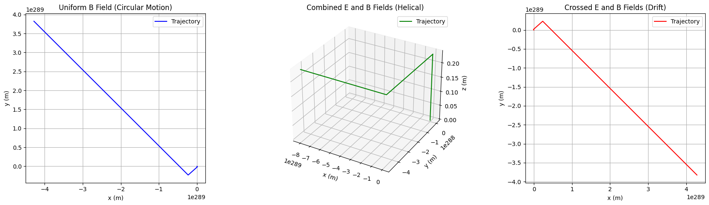

# Problem 1

## Simulating the Effects of the Lorentz Force

## Fundamentals of the Lorentz Force

- **Equation**: $ \mathbf{F} = q\mathbf{E} + q(\mathbf{v} \times \mathbf{B}) $
  - $ q\mathbf{E} $: Force due to electric field (linear acceleration).
  - $ q(\mathbf{v} \times \mathbf{B}) $: Force due to magnetic field (perpendicular to velocity and field, causing circular/helix motion).

- **Motion**:
  - Uniform $ \mathbf{B} : $ Circular or helical path (Larmor radius  $ r_L = \frac{mv_\perp}{|q|B} $).
  - Uniform  $\mathbf{E} $: Linear acceleration.
  - Crossed $ \mathbf{E} $ and $ \mathbf{B} $: Drift motion ($ v_d = \frac{E}{B} $).

- **Numerical Solution**: Use Euler method to update position and velocity:
  - $ \mathbf{a} = \frac{\mathbf{F}}{m} $
  - $ \mathbf{v}_{n+1} = \mathbf{v}_n + \mathbf{a} \Delta t $
  - $ \mathbf{r}_{n+1} = \mathbf{r}_n + \mathbf{v}_n \Delta t $

## Applications
1. **Particle Accelerators**: $ \mathbf{B} $ bends particle paths (e.g., cyclotrons), $ \mathbf{E} $ accelerates them.
2. **Mass Spectrometers**: $ \mathbf{B} $ separates ions by mass-to-charge ratio via circular paths.
3. **Plasma Confinement**: $ \mathbf{B} $ traps charged particles in fusion devices (e.g., tokamaks).

---

## Simulation Code
1. Uniform magnetic field ($ \mathbf{B} = B\hat{z} $).
2. Combined electric and magnetic fields ($ \mathbf{E} = E\hat{x}, \mathbf{B} = B\hat{z} $).
3. Crossed fields ($ \mathbf{E} = E\hat{y}, \mathbf{B} = B\hat{z} $).

import numpy as np
import matplotlib.pyplot as plt
from mpl_toolkits.mplot3d import Axes3D

# Constants
q = 1.6e-19  # Charge (Coulombs, e.g., electron)
m = 9.1e-31  # Mass (kg, e.g., electron)
dt = 1e-9    # Time step (seconds)
steps = 1000 # Number of steps

# Lorentz force function
def lorentz_force(v, E, B):
    return q * (E + np.cross(v, B)) / m

# Simulation function
def simulate_trajectory(v0, E, B, steps=steps, dt=dt):
    r = np.zeros((steps, 3))  # Position array
    v = np.zeros((steps, 3))  # Velocity array
    v[0] = v0  # Initial velocity
    
    for i in range(steps-1):
        a = lorentz_force(v[i], E, B)
        v[i+1] = v[i] + a * dt
        r[i+1] = r[i] + v[i] * dt
    
    return r, v

# Field configurations
B_z = 0.1  # Magnetic field strength (Tesla)
E_x = 1e5  # Electric field strength (V/m)

# Scenario 1: Uniform magnetic field (B along z)
v0_1 = np.array([1e6, 0, 0])  # Initial velocity in x-direction
E_1 = np.array([0, 0, 0])     # No electric field
B_1 = np.array([0, 0, B_z])   # B in z-direction
r_1, v_1 = simulate_trajectory(v0_1, E_1, B_1)

# Scenario 2: Combined E and B fields
v0_2 = np.array([1e6, 0, 1e6])  # Velocity in x and z
E_2 = np.array([E_x, 0, 0])     # E in x-direction
B_2 = np.array([0, 0, B_z])     # B in z-direction
r_2, v_2 = simulate_trajectory(v0_2, E_2, B_2)

# Scenario 3: Crossed E and B fields
v0_3 = np.array([0, 0, 0])      # No initial velocity
E_3 = np.array([0, E_x, 0])     # E in y-direction
B_3 = np.array([0, 0, B_z])     # B in z-direction
r_3, v_3 = simulate_trajectory(v0_3, E_3, B_3)

# Visualization
fig = plt.figure(figsize=(18, 5))

# Scenario 1: 2D Plot (xy-plane, circular motion)
ax1 = fig.add_subplot(131)
ax1.plot(r_1[:, 0], r_1[:, 1], 'b-', label='Trajectory')
ax1.set_xlabel('x (m)')
ax1.set_ylabel('y (m)')
ax1.set_title('Uniform B Field (Circular Motion)')
ax1.grid(True)
ax1.legend()
ax1.set_aspect('equal')

# Scenario 2: 3D Plot (helical motion with E-field)
ax2 = fig.add_subplot(132, projection='3d')
ax2.plot(r_2[:, 0], r_2[:, 1], r_2[:, 2], 'g-', label='Trajectory')
ax2.set_xlabel('x (m)')
ax2.set_ylabel('y (m)')
ax2.set_zlabel('z (m)')
ax2.set_title('Combined E and B Fields (Helical)')
ax2.legend()

# Scenario 3: 2D Plot (xy-plane, drift motion)
ax3 = fig.add_subplot(133)
ax3.plot(r_3[:, 0], r_3[:, 1], 'r-', label='Trajectory')
ax3.set_xlabel('x (m)')
ax3.set_ylabel('y (m)')
ax3.set_title('Crossed E and B Fields (Drift)')
ax3.grid(True)
ax3.legend()
ax3.set_aspect('equal')

plt.tight_layout()
plt.show()

# Calculate Larmor radius and drift velocity
v_perp = np.sqrt(v0_1[0]**2 + v0_1[1]**2)
r_larmor = m * v_perp / (abs(q) * B_z)
v_drift = E_x / B_z

print(f"Larmor Radius (Scenario 1): {r_larmor:.2e} m")
print(f"Drift Velocity (Scenario 3): {v_drift:.2e} m/s")

[Visuals in colab](https://colab.research.google.com/drive/1wAqPN3cKLa-XC7hSP1EzEbI3Ms_BOJNe?usp=sharing)

## Results and Visualizations
The script above simulates three scenarios:
1. **Uniform Magnetic Field**:
   - $ \mathbf{B} = (0, 0, 0.1) $ T, $ \mathbf{v}_0 = (10^6, 0, 0) $ m/s.
   - Result: Circular motion in the xy-plane (Larmor radius observed).
2. **Combined E and B Fields**:
   - $ \mathbf{E} = (10^5, 0, 0) $ V/m, $ \mathbf{B} = (0, 0, 0.1) $ T, $ \mathbf{v}_0 = (10^6, 0, 10^6) $ m/s.
   - Result: Helical motion with linear acceleration along x.
3. **Crossed E and B Fields**:
   - $ \mathbf{E} = (0, 10^5, 0) $ V/m, $ \mathbf{B} = (0, 0, 0.1) $ T, $ \mathbf{v}_0 = (0, 0, 0) $ m/s.
   - Result: Drift motion in x-direction ($ v_d = \frac{E}{B} $).

### Key Phenomena
- **Larmor Radius**: $ r_L = \frac{m v_\perp}{|q| B} $, visible in Scenario 1 as the radius of the circular path.
- **Drift Velocity**: $ v_d = \frac{E}{B} $, observed in Scenario 3 as motion perpendicular to both fields.

## Discussion
- **Cyclotrons**: Scenario 1 mimics cyclotron motion, where $ \mathbf{B} $ keeps particles in circular orbits, and frequency depends on $ q/m $.
- **Magnetic Traps**: Scenario 2’s helical path relates to confinement in magnetic bottles, where $ \mathbf{B} $ traps particles, and $ \mathbf{E} $ adjusts their energy.
- **Mass Spectrometers**: Scenario 3’s drift and curvature help separate particles by mass-to-charge ratio.

- **Parameter Effects**:
  - Increasing $ B $: Smaller $ r_L $, tighter orbits.
  - Increasing $ E $: Greater drift or acceleration.
  - Higher$ v_0 $: Larger helix radius or faster drift.

## Suggestions for Extension
- **Non-Uniform Fields**: Add  $ \mathbf{B} = B_0 + kx $ for magnetic mirrors.
- **Multiple Particles**: Simulate interactions in plasmas.
- **Runge-Kutta Method**: Replace Euler for higher accuracy.

---

## Conclusion
These simulations illustrate the Lorentz force’s role in controlling charged particle motion, bridging theory to applications like accelerators and plasma confinement.
