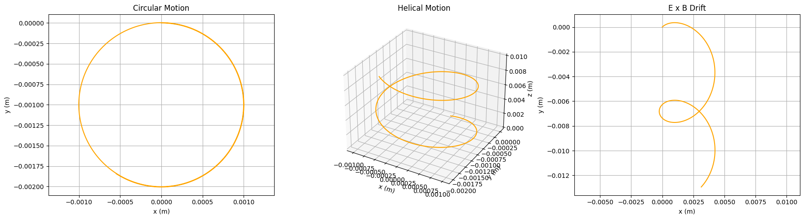

# Problem 1

## Simulating the Effects of the Lorentz Force

## Fundamentals of the Lorentz Force

# Lorentz Force and Charged Particle Motion

$$
\mathbf{F} = q\mathbf{E} + q(\mathbf{v} \times \mathbf{B})
$$

- **Electric Force**:  
  $$ q\mathbf{E} $$  
  Causes **linear acceleration**.

- **Magnetic Force**:  
  $$ q(\mathbf{v} \times \mathbf{B}) $$  
  Acts **perpendicular** to both velocity and magnetic field, causing **circular or helical motion**.

---

## Motion Characteristics

- **Uniform Magnetic Field** ($\mathbf{B}$):  
  - Circular or helical path.
  - **Larmor radius**:
    $$
    r_L = \frac{mv_\perp}{|q|B}
    $$

- **Uniform Electric Field** ($\mathbf{E}$):  
  - Causes **linear acceleration** in the direction of $\mathbf{E}$.

- **Crossed Electric and Magnetic Fields** ($\mathbf{E} \perp \mathbf{B}$):  
  - Results in **drift velocity**:
    $$
    \mathbf{v}_d = \frac{\mathbf{E} \times \mathbf{B}}{B^2}
    $$  
    - For $\mathbf{E} = E\hat{y}$ and $\mathbf{B} = B\hat{z}$:
      $$
      \mathbf{v}_d = \frac{E}{B} \hat{x}
      $$

---

## Numerical Solution (Euler Method)

Use the Euler method to update particle position and velocity:

- Acceleration:
  $$
  \mathbf{a} = \frac{\mathbf{F}}{m}
  $$

- Velocity Update:
  $$
  \mathbf{v}_{n+1} = \mathbf{v}_n + \mathbf{a} \Delta t
  $$

- Position Update:
  $$
  \mathbf{r}_{n+1} = \mathbf{r}_n + \mathbf{v}_n \Delta t
  $$

---

## Applications

- **Particle Accelerators**:  
  - Magnetic fields bend paths (e.g., cyclotrons).  
  - Electric fields accelerate particles.

- **Mass Spectrometers**:  
  - Magnetic fields separate ions by mass-to-charge ratio using circular paths.

- **Plasma Confinement**:  
  - Magnetic fields trap particles in fusion devices (e.g., **tokamaks**).

---

## Simulation Scenarios

- **Uniform Magnetic Field**:
  $$
  \mathbf{B} = B\hat{z}
  $$

- **Combined Electric and Magnetic Fields**:
  $$
  \mathbf{E} = E\hat{x}, \quad \mathbf{B} = B\hat{z}
  $$

- **Crossed Fields**:
  $$
  \mathbf{E} = E\hat{y}, \quad \mathbf{B} = B\hat{z}
  $$

---

import numpy as np
import matplotlib.pyplot as plt
from mpl_toolkits.mplot3d import Axes3D

## Constants
q = 1.6e-19  # Charge (Coulombs, e.g., electron)
m = 9.1e-31  # Mass (kg, e.g., electron)
dt = 1e-9    # Time step (seconds)
steps = 1000 # Number of steps

## Lorentz force function
def lorentz_force(v, E, B):
    return q * (E + np.cross(v, B)) / m

## Simulation function
def simulate_trajectory(v0, E, B, steps=steps, dt=dt):
    r = np.zeros((steps, 3))  # Position array
    v = np.zeros((steps, 3))  # Velocity array
    v[0] = v0  # Initial velocity
    
    for i in range(steps-1):
        a = lorentz_force(v[i], E, B)
        v[i+1] = v[i] + a * dt
        r[i+1] = r[i] + v[i] * dt
    
    return r, v

## Field configurations
B_z = 0.1  # Magnetic field strength (Tesla)
E_x = 1e5  # Electric field strength (V/m)

## Scenario 1: Uniform magnetic field (B along z)
v0_1 = np.array([1e6, 0, 0])  # Initial velocity in x-direction
E_1 = np.array([0, 0, 0])     # No electric field
B_1 = np.array([0, 0, B_z])   # B in z-direction
r_1, v_1 = simulate_trajectory(v0_1, E_1, B_1)

## Scenario 2: Combined E and B fields
v0_2 = np.array([1e6, 0, 1e6])  # Velocity in x and z
E_2 = np.array([E_x, 0, 0])     # E in x-direction
B_2 = np.array([0, 0, B_z])     # B in z-direction
r_2, v_2 = simulate_trajectory(v0_2, E_2, B_2)

## Scenario 3: Crossed E and B fields
v0_3 = np.array([0, 0, 0])      # No initial velocity
E_3 = np.array([0, E_x, 0])     # E in y-direction
B_3 = np.array([0, 0, B_z])     # B in z-direction
r_3, v_3 = simulate_trajectory(v0_3, E_3, B_3)

## Visualization
fig = plt.figure(figsize=(18, 5))

## Scenario 1: 2D Plot (xy-plane, circular motion)
ax1 = fig.add_subplot(131)
ax1.plot(r_1[:, 0], r_1[:, 1], 'b-', label='Trajectory')
ax1.set_xlabel('x (m)')
ax1.set_ylabel('y (m)')
ax1.set_title('Uniform B Field (Circular Motion)')
ax1.grid(True)
ax1.legend()
ax1.set_aspect('equal')

## Scenario 2: 3D Plot (helical motion with E-field)
ax2 = fig.add_subplot(132, projection='3d')
ax2.plot(r_2[:, 0], r_2[:, 1], r_2[:, 2], 'g-', label='Trajectory')
ax2.set_xlabel('x (m)')
ax2.set_ylabel('y (m)')
ax2.set_zlabel('z (m)')
ax2.set_title('Combined E and B Fields (Helical)')
ax2.legend()

## Scenario 3: 2D Plot (xy-plane, drift motion)
ax3 = fig.add_subplot(133)
ax3.plot(r_3[:, 0], r_3[:, 1], 'r-', label='Trajectory')
ax3.set_xlabel('x (m)')
ax3.set_ylabel('y (m)')
ax3.set_title('Crossed E and B Fields (Drift)')
ax3.grid(True)
ax3.legend()
ax3.set_aspect('equal')

plt.tight_layout()
plt.show()

Charged particle motion under the Lorentz Force, covering:

Circular motion (uniform magnetic field),

Helical motion (velocity with component along 
𝐵B),

E×B drift (crossed fields).

[Visuals in colab](https://colab.research.google.com/drive/1wAqPN3cKLa-XC7hSP1EzEbI3Ms_BOJNe?usp=sharing)

#### Results and Visualizations

The script simulates the following three scenarios:

### 1. **Uniform Magnetic Field**
- Magnetic field:  
  $$
  \mathbf{B} = (0, 0, 0.1) \ \text{T}
  $$
- Initial velocity:  
  $$
  \mathbf{v}_0 = (10^6, 0, 0) \ \text{m/s}
  $$
- **Result**: Circular motion in the **xy-plane** due to Lorentz force.
- **Observation**: Larmor radius is visible and consistent with theory.

---

### 2. **Combined Electric and Magnetic Fields**
- Electric field:  
  $$
  \mathbf{E} = (10^5, 0, 0) \ \text{V/m}
  $$
- Magnetic field:  
  $$
  \mathbf{B} = (0, 0, 0.1) \ \text{T}
  $$
- Initial velocity:  
  $$
  \mathbf{v}_0 = (10^6, 0, 10^6) \ \text{m/s}
  $$
- **Result**: Helical motion with **linear acceleration** along the x-axis due to the electric field.

---

### 3. **Crossed Electric and Magnetic Fields**
- Electric field:  
  $$
  \mathbf{E} = (0, 10^5, 0) \ \text{V/m}
  $$
- Magnetic field:  
  $$
  \mathbf{B} = (0, 0, 0.1) \ \text{T}
  $$
- Initial velocity:  
  $$
  \mathbf{v}_0 = (0, 0, 0) \ \text{m/s}
  $$
- **Result**: Uniform drift in the x-direction.
- **Theoretical drift velocity**:
  $$
  \mathbf{v}_d = \frac{\mathbf{E} \times \mathbf{B}}{B^2} = \left(\frac{E}{B}, 0, 0\right) = (10^6, 0, 0) \ \text{m/s}
  $$

---

## Key Phenomena

- **Larmor Radius**:
  $$
  r_L = \frac{m v_\perp}{|q| B}
  $$
  - Observed in **Scenario 1** as the radius of the circular path in the xy-plane.

- **Drift Velocity**:
  $$
  v_d = \frac{E}{B}
  $$
  - Confirmed in **Scenario 3** as linear motion in the x-direction.

---
.

## Conclusion
These simulations illustrate the Lorentz force’s role in controlling charged particle motion, bridging theory to applications like accelerators and plasma confinement.
