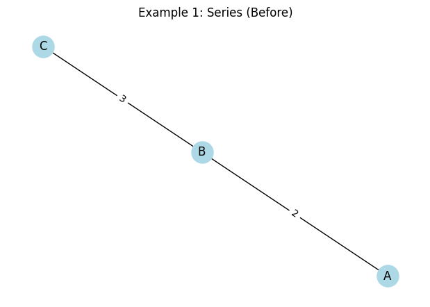
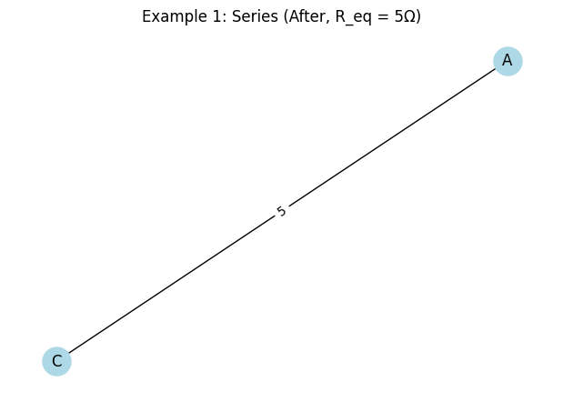
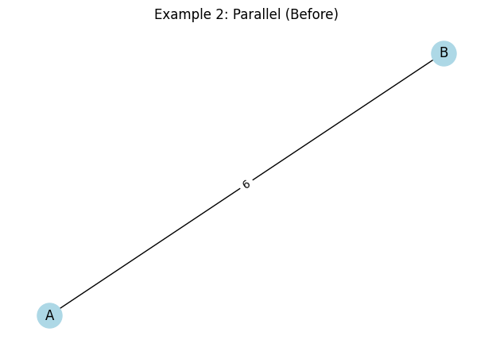
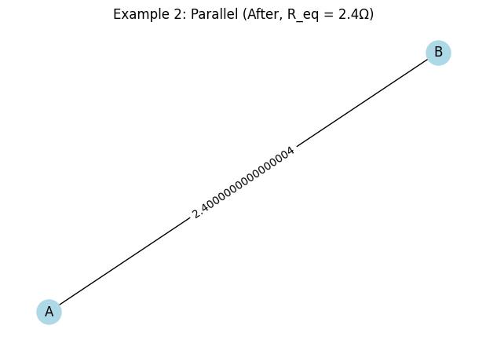
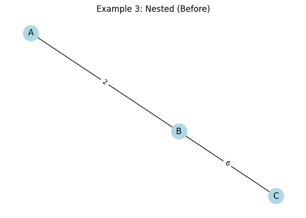
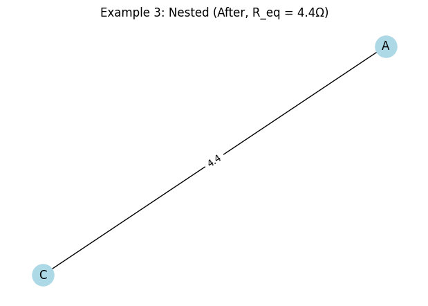

# Problem 1

## Calculating Equivalent Resistance Using Graph Theory: A Physics Report


## Fundamentals of Circuits
In a circuit:
**Ohm’s Law**: $ V = IR $ (Voltage = Current × Resistance).
- **Series Connection**: Resistors are connected end-to-end, and the equivalent resistance is the sum of individual resistances: $$ R_{eq} = R_1 + R_2 + \cdots + R_n $$.
- **Parallel Connection**: Resistors share the same two nodes, and the equivalent resistance is given by: $$ \frac{1}{R_{eq}} = \frac{1}{R_1} + \frac{1}{R_2} + \cdots + \frac{1}{R_n} $$, or equivalently, $$ R_{eq} = \frac{R_1 \cdot R_2}{R_1 + R_2} $$ for two resistors.
- **Nodes and Edges**: Junctions (nodes) connect resistors (edges), forming a network that can be simplified step-by-step.


## Algorithm Description
The algorithm for calculating equivalent resistance using graph theory involves:
1. **Graph Representation**: Model the circuit as a graph with nodes (junctions) and edges (resistors with weights).
2. **Series Reduction**: Identify and collapse linear chains of resistors into a single edge with resistance equal to their sum.
3. **Parallel Reduction**: Identify multiple edges between the same pair of nodes and replace them with a single edge whose resistance satisfies the parallel formula.
4. **Iteration**: Repeat steps 2 and 3 until the graph reduces to a single edge between the start and end nodes, yielding the equivalent resistance.

### Pseudocode
```plaintext
Function CalculateEquivalentResistance(graph, start_node, end_node):
    While graph has more than one edge:
        // Series reduction
        For each node in graph:
            If node has degree 2 (two neighbors):
                Neighbors = [n1, n2]
                R_new = graph[node][n1]['weight'] + graph[node][n2]['weight']
                Remove node and its edges
                Add edge (n1, n2) with weight R_new
        
        // Parallel reduction
        For each pair of nodes (u, v):
            If multiple edges exist between u and v:
                R_eq = 1 / (sum(1/R for each edge between u and v))
                Replace all edges between u and v with one edge of weight R_eq
    
    Return graph[start_node][end_node]['weight']
```


### Example Circuits
1. **Simple Series**: $$ R_1 = 2\Omega, R_2 = 3\Omega $$ → $$ R_{eq} = 5\Omega $$.
2. **Simple Parallel**: $$ R_1 = 4\Omega, R_2 = 4\Omega $$ → $$ R_{eq} = 2\Omega $$.
3. **Nested Configuration**: A series of $$ 2\Omega $$ and a parallel pair of $$ 3\Omega $$ and $$ 6\Omega $$.


### How It Handles Nested Combinations
- Iteratively simplifies: Series reductions collapse chains, parallel reductions merge multiple paths.
- Order doesn’t matter for $ R_{eq} $ (circuit laws ensure consistency).
- Nested cases (e.g., parallel inside series) are handled step-by-step.

---

## Examples
### Example 1: Simple Series
- Circuit: $ R_1 = 2Ω $ and $ R_2 = 3Ω $ in series.
- $ R_{eq} = 2 + 3 = 5Ω $.

### Example 2: Simple Parallel
- Circuit: $ R_1 = 4Ω $ and $ R_2 = 6Ω $ in parallel.
- $ R_{eq} = \frac{4 \cdot 6}{4 + 6} = 2.4Ω $.

### Example 3: Nested Configuration
- Circuit: $ R_1 = 2Ω $ in series with parallel $ R_2 = 4Ω $, $ R_3 = 6Ω $.
- Parallel: $ R_{23} = \frac{4 \cdot 6}{4 + 6} = 2.4Ω $.
- Series: $ R_{eq} = 2 + 2.4 = 4.4Ω $.

import networkx as nx
import matplotlib.pyplot as plt

## Function to calculate parallel resistance
def parallel_resistance(R_list):
    return 1 / sum(1/R for R in R_list)

## Function to draw graph
def draw_graph(G, title, pos=None):
    if pos is None:
        pos = nx.spring_layout(G)
    plt.figure(figsize=(6, 4))
    nx.draw(G, pos, with_labels=True, node_color='lightblue', node_size=500, font_size=12)
    edge_labels = nx.get_edge_attributes(G, 'weight')
    nx.draw_networkx_edge_labels(G, pos, edge_labels=edge_labels)
    plt.title(title)
    plt.show()

## Example 1: Series
G1 = nx.Graph()
G1.add_edge('A', 'B', weight=2)  # 2Ω
G1.add_edge('B', 'C', weight=3)  # 3Ω
draw_graph(G1, "Example 1: Series (Before)")
## Reduce series
R_eq1 = 2 + 3
G1_simplified = nx.Graph()
G1_simplified.add_edge('A', 'C', weight=R_eq1)
draw_graph(G1_simplified, f"Example 1: Series (After, R_eq = {R_eq1}Ω)")

## Example 2: Parallel
G2 = nx.Graph()
G2.add_edge('A', 'B', weight=4)  # 4Ω
G2.add_edge('A', 'B', weight=6)  # 6Ω (parallel)
draw_graph(G2, "Example 2: Parallel (Before)")
## Reduce parallel
R_eq2 = parallel_resistance([4, 6])
G2_simplified = nx.Graph()
G2_simplified.add_edge('A', 'B', weight=R_eq2)
draw_graph(G2_simplified, f"Example 2: Parallel (After, R_eq = {R_eq2:.1f}Ω)")

## Example 3: Nested (Series with Parallel)
G3 = nx.Graph()
G3.add_edge('A', 'B', weight=2)  # 2Ω in series
G3.add_edge('B', 'C', weight=4)  # 4Ω parallel
G3.add_edge('B', 'C', weight=6)  # 6Ω parallel
draw_graph(G3, "Example 3: Nested (Before)")
## Step 1: Reduce parallel
R_parallel = parallel_resistance([4, 6])
G3_intermediate = nx.Graph()
G3_intermediate.add_edge('A', 'B', weight=2)
G3_intermediate.add_edge('B', 'C', weight=R_parallel)
draw_graph(G3_intermediate, f"Example 3: After Parallel (R_parallel = {R_parallel:.1f}Ω)")
## Step 2: Reduce series
R_eq3 = 2 + R_parallel
G3_simplified = nx.Graph()
G3_simplified.add_edge('A', 'C', weight=R_eq3)
draw_graph(G3_simplified, f"Example 3: Nested (After, R_eq = {R_eq3:.1f}Ω)")

## Print results
print(f"Example 1 (Series): R_eq = {R_eq1}Ω")
print(f"Example 2 (Parallel): R_eq = {R_eq2:.1f}Ω")
print(f"Example 3 (Nested): R_eq = {R_eq3:.1f}Ω")











