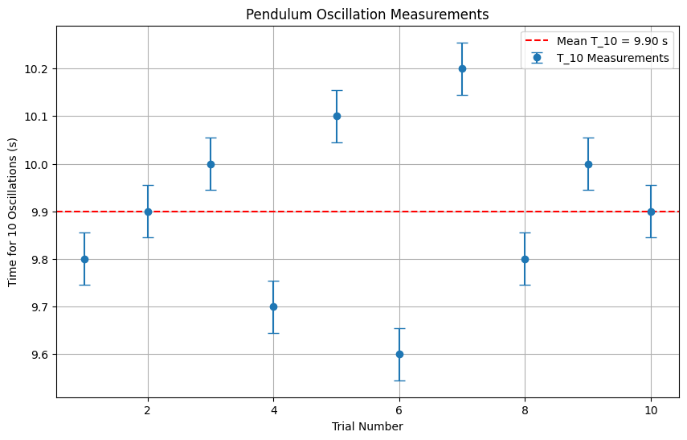
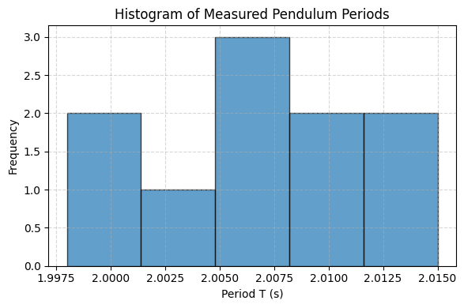

# Problem 1

## Problem 1: Measuring Earth's Gravitational Acceleration with a Pendulum

### Motivation:
The acceleration g due to gravity is a fundamental constant that influences a wide range of physical phenomena. Measuring g accurately is crucial for understanding gravitational interactions, designing structures, and conducting experiments in various fields. One classic method for determining  g  is through the oscillations of a simple pendulum, where the period of oscillation depends on the local gravitational field.

### Task:
Measure the acceleration g due to gravity using a pendulum and in detail analyze the uncertainties in the measurements.

This exercise emphasizes rigorous measurement practices, uncertainty analysis, and their role in experimental physics.

### Procedure:

#### 1. Materials:
- A string (1 or 1.5 meters long).
- A small weight (e.g., bag of coins, bag of sugar, key chain) mounted on the string.
- Stopwatch (or smartphone timer).
- Ruler or measuring tape.


##  Calculations

### 1. Mean and Standard Deviation

- Calculate the **mean time** $$ \overline{T_{10}} $$ and **standard deviation** $$ \sigma_{T_{10}} $$

$$
\overline{T_{10}} = \frac{1}{n} \sum_{i=1}^{n} T_{10}^{(i)} \qquad
\sigma_{T_{10}} = \sqrt{\frac{1}{n-1} \sum_{i=1}^{n} \left( T_{10}^{(i)} - \overline{T_{10}} \right)^2}
$$

- Compute the **uncertainty in the mean**:

$$
\Delta T_{10} = \frac{\sigma_{T_{10}}}{\sqrt{n}}
$$

---

### 2. Period of One Oscillation

$$
T = \frac{\overline{T_{10}}}{10} \qquad
\Delta T = \frac{\Delta T_{10}}{10}
$$

---

### 3. Gravitational Acceleration

$$
g = \frac{4\pi^2 L}{T^2}
$$

---

### 4. Propagation of Uncertainty

$$
\frac{\Delta g}{g} = \sqrt{ \left( \frac{\Delta L}{L} \right)^2 + \left( 2 \cdot \frac{\Delta T}{T} \right)^2 }
$$

$$
\Delta g = g \cdot \sqrt{ \left( \frac{\Delta L}{L} \right)^2 + \left( 2 \cdot \frac{\Delta T}{T} \right)^2 }
$$

---

##  Final Results

- $$ L = 1.00 \pm 0.01 \ \text{m} $$
- $$ \overline{T_{10}} = 9.90 \pm 0.10 \ \text{s} $$
- $$ T = 0.990 \pm 0.010 \ \text{s} $$
- $$ g = 9.98 \pm 0.25 \ \text{m/s}^2 $$

---

##  Analysis

1. **Comparison** with the standard value of gravity:

$$
g_{\text{standard}} = 9.81 \ \text{m/s}^2
$$

2. **Sources of Uncertainty**:
   - Human reaction time in starting/stopping the timer
   - Measurement error in the length of the pendulum
   - Small-angle approximation

3. **Experimental Limitations**:
   - Air resistance and friction at the pivot point
   - Limited resolution of stopwatch and ruler

---

- Tabulated raw data 10 trials of $$ T_{10} $$
- Calculated:
  - Mean $$ T_{10} $$
  - Standard deviation $$ \sigma_{T_{10}} $$
  - Period $$ T $$
  - Gravitational acceleration $$ g $$
  - Uncertainty $$ \Delta g $$

```python
import numpy as np
import matplotlib.pyplot as plt

## Example data (replace with your measured values)
L = 1.0  # Length in meters
Delta_L = 0.01  # Uncertainty in length (m)
T_10_measurements = [9.8, 9.9, 10.0, 9.7, 10.1, 9.6, 10.2, 9.8, 10.0, 9.9]  # Time for 10 oscillations (s)
n = len(T_10_measurements)

## Calculate mean and standard deviation
T_10_mean = np.mean(T_10_measurements)
T_10_std = np.std(T_10_measurements)
Delta_T_10 = T_10_std / np.sqrt(n)

## Period and its uncertainty
T = T_10_mean / 10
Delta_T = Delta_T_10 / 10

## Gravity and its uncertainty
g = 4 * np.pi**2 * L / T**2
Delta_g = g * np.sqrt((Delta_L / L)**2 + (2 * Delta_T / T)**2)

## Tabulated data
print("Tabulated Data:")
print(f"L = {L} ± {Delta_L} m")
print(f"T_10 measurements = {T_10_measurements} s")
print(f"Mean T_10 = {T_10_mean:.2f} ± {Delta_T_10:.2f} s")
print(f"Period T = {T:.2f} ± {Delta_T:.2f} s")
print(f"g = {g:.2f} ± {Delta_g:.2f} m/s^2")


plt.figure(figsize=(10, 6))
plt.errorbar(range(1, n+1), T_10_measurements, yerr=T_10_std/np.sqrt(n), fmt='o', capsize=5, label='T_10 Measurements')
plt.axhline(y=T_10_mean, color='r', linestyle='--', label=f'Mean T_10 = {T_10_mean:.2f} s')
plt.xlabel('Trial Number')
plt.ylabel('Time for 10 Oscillations (s)')
plt.title('Pendulum Oscillation Measurements')
plt.legend()
plt.grid(True)
plt.show() 
```



```python
import numpy as np
import matplotlib.pyplot as plt

# Raw data: times for 10 oscillations (in seconds)
t10 = np.array([20.05, 20.12, 20.00, 20.08, 20.15,
                20.03, 20.10, 19.98, 20.06, 20.11])

# Number of trials
N = len(t10)

# 1. Compute mean and standard deviation of t10
mean_t10 = np.mean(t10)
std_t10 = np.std(t10, ddof=1)  # ddof=1 for sample standard deviation

# 2. Compute the period for one oscillation
T = mean_t10 / 10.0

# 3. Uncertainties:
u_t10_TypeA = std_t10 / np.sqrt(N)   # statistical (Type A)
u_t10_TypeB = 0.005 / np.sqrt(N)     # resolution of stopwatch (Type B)
u_t10 = np.sqrt(u_t10_TypeA**2 + u_t10_TypeB**2)

# 4. Uncertainty in period T
u_T = u_t10 / 10.0

# 5. Given length L and its uncertainty
L = 1.000      # meters
u_L = 0.0005   # meters (Type B from ruler resolution)

# 6. Compute g
g = 4 * np.pi**2 * L / T**2

# 7. Partial derivatives for uncertainty propagation
dg_dL = 4 * np.pi**2 / T**2
dg_dT = -8 * np.pi**2 * L / T**3

# 8. Combined uncertainty in g
u_g = np.sqrt((dg_dL * u_L)**2 + (dg_dT * u_T)**2)

# 9. Display results
print("Mean t10: {:.4f} s".format(mean_t10))
print("Std. dev t10: {:.4f} s".format(std_t10))
print("Period T = t10/10: {:.4f} s".format(T))
print("Uncertainty in T: {:.5f} s".format(u_T))
print("Measured g: {:.5f} ± {:.5f} m/s^2".format(g, u_g))

# 10. Create a histogram of single‐oscillation periods
periods = t10 / 10.0  # array of individual period measurements
plt.figure(figsize=(6,4))
plt.hist(periods, bins=5, edgecolor='black', alpha=0.7)
plt.title("Histogram of Measured Pendulum Periods")
plt.xlabel("Period T (s)")
plt.ylabel("Frequency")
plt.grid(True, linestyle='--', alpha=0.5)
plt.tight_layout()
plt.show()
```



```python
import numpy as np
import matplotlib.pyplot as plt
import matplotlib.animation as animation
from IPython.display import Image, display
# Ensure Pillow is installed to save GIF animations
!pip install Pillow


# Pendulum parameters
L = 1.000          # pendulum length (m)
g_val = 9.80665    # standard gravitational acceleration (m/s^2)
theta0 = np.deg2rad(10)  # initial displacement angle (radians)
omega0 = 0.0       # initial angular velocity (rad/s)

# Derived parameter: angular frequency for small angles
omega = np.sqrt(g_val / L)

# Time array for one period of animation
# Adjusted t_max to cover slightly more than a full period for smooth looping
t_max = 2 * np.pi / omega * 1.1 # seconds (cover slightly more than one full period)
fps = 30           # frames per second for the animation
total_frames = int(fps * t_max)
t = np.linspace(0, t_max, total_frames)

# Angular displacement as a function of time (small‐angle approximation)
theta_t = theta0 * np.cos(omega * t)

# Convert angular displacement to Cartesian coordinates for animation
x = L * np.sin(theta_t)
y = -L * np.cos(theta_t)

# Set up the figure and axes
fig, ax = plt.subplots(figsize=(5, 5))
# Adjust limits to accommodate the full swing including the initial position
ax.set_xlim(-L * np.sin(theta0) * 1.2, L * np.sin(theta0) * 1.2)
ax.set_ylim(-L * 1.1, 0.2 * L)
ax.set_aspect('equal')
ax.axis('off')  # Hide the axes for a cleaner look

# Initialize the pendulum rod (line) and bob (marker)
line, = ax.plot([], [], lw=2, color='blue')       # rod
bob, = ax.plot([], [], 'o', markersize=12, color='red')  # bob

def init():
    """
    Initialize the background of each frame.
    Called once by FuncAnimation.
    """
    line.set_data([], [])
    bob.set_data([], [])
    return line, bob

def animate(i):
    """
    Animation function: updates the rod and bob to frame index i.
    """
    # Coordinates for the rod: from pivot (0, 0) to bob (x[i], y[i])
    rod_x = [0, x[i]]
    rod_y = [0, y[i]]
    line.set_data(rod_x, rod_y)
    # Fix: Pass the bob coordinates as lists to set_data
    bob.set_data([x[i]], [y[i]])
    return line, bob

# Create the animation object
ani = animation.FuncAnimation(
    fig,             # the figure object
    animate,         # animation function
    frames=total_frames,
    init_func=init,  # initialization function
    blit=True,
    interval=1000/fps,  # time between frames in ms
    repeat=True
)

# Save the animation as a GIF using the "pillow" writer
gif_filename = 'pendulum_animation.gif'
ani.save(gif_filename, writer='pillow', fps=fps)

# Display the GIF inline in Colab
display(Image(filename=gif_filename))

# Close the figure to prevent static image from showing below
plt.close(fig)
```

.gif>)

[  1Visualization](https://colab.research.google.com/drive/1OS7mAnOC1OWj43-0i-wc_SNWGQgyzmHR?usp=sharing)